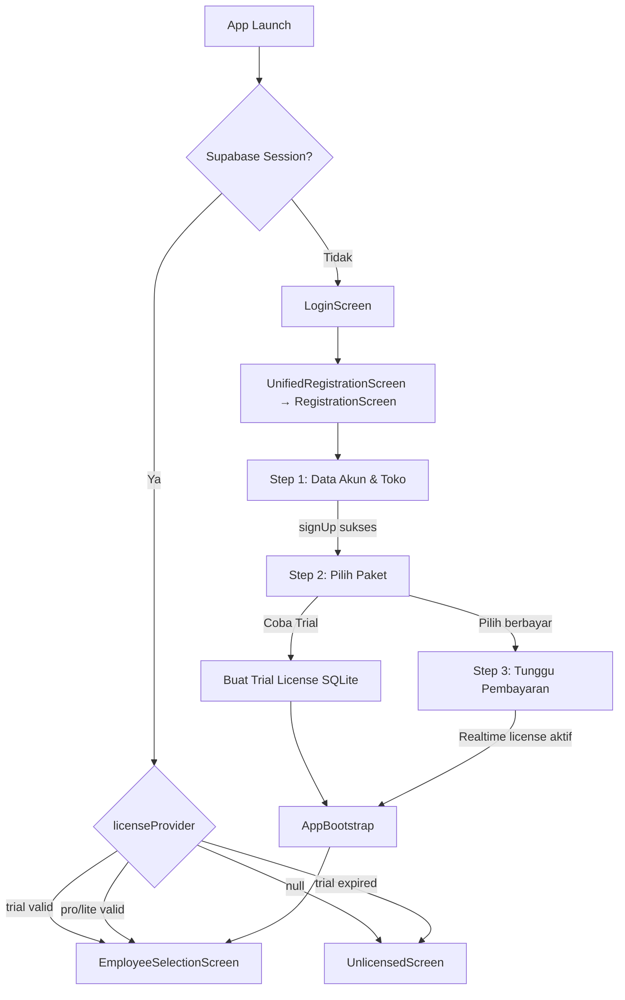

# Design Document: Mobile Registration & Subscription Flow

## Overview

Fitur ini mengubah flow registrasi mobile Lumio POS dari satu langkah tunggal (`UnifiedRegistrationScreen`) menjadi tiga langkah terstruktur yang selaras dengan flow web (`RegisterForm` di `lumiopos-web`). Perubahan mencakup:

1. **Mobile (Flutter)**: Refactor `UnifiedRegistrationScreen` menjadi `RegistrationScreen` multi-step dengan Step 1 (data akun & toko), Step 2 (pilih paket), dan Step 3 (tunggu pembayaran).
2. **Web API (Next.js)**: Modifikasi `/api/subscription/checkout` dan `/api/subscription/status` agar mendukung autentikasi Bearer token dari mobile, di samping cookie session yang sudah ada.
3. **Trial License**: Penambahan mekanisme trial license lokal 7 hari di SQLite tanpa memanggil API eksternal.
4. **AppBootstrap**: Penambahan dukungan tier `'trial'` di routing logic.

Desain ini mengikuti pola arsitektur yang sudah ada: Riverpod untuk state management, Drift ORM untuk SQLite, Supabase untuk cloud, dan Dio untuk HTTP.

---

## Architecture

### Alur Keseluruhan



### Komponen yang Dimodifikasi

| Komponen | Lokasi | Perubahan |
|---|---|---|
| `UnifiedRegistrationScreen` | `mobile/lib/features/auth/screens/` | Diganti dengan `RegistrationScreen` multi-step |
| `LicenseNotifier` / `licenseProvider` | `mobile/lib/features/auth/providers/auth_providers.dart` | Tambah method `createTrialLicense()` |
| `AppBootstrap` | `mobile/lib/main.dart` | Tambah handling tier `'trial'` |
| `appTierProvider` | `mobile/lib/core/providers/license_tier_provider.dart` | Sudah support `'trial'` via `tierLevel` |
| `/api/subscription/checkout` | `lumiopos-web/app/api/subscription/checkout/route.ts` | Tambah Bearer token auth |
| `/api/subscription/status` | `lumiopos-web/app/api/subscription/status/route.ts` | Tambah Bearer token auth |
| `lib/auth/auth-helper.ts` | `lumiopos-web/lib/auth/` | **Baru**: shared auth helper |

### Komponen Baru (Mobile)

| Komponen | Lokasi | Fungsi |
|---|---|---|
| `RegistrationScreen` | `mobile/lib/features/auth/screens/registration_screen.dart` | Widget utama multi-step |
| `StepIndicatorWidget` | `mobile/lib/features/auth/widgets/step_indicator_widget.dart` | Visual progress 3 langkah |
| `PackageCardWidget` | `mobile/lib/features/auth/widgets/package_card_widget.dart` | Kartu paket berlangganan |
| `RegistrationNotifier` | `mobile/lib/features/auth/providers/registration_provider.dart` | State management registrasi |
| `SubscriptionPackage` | `mobile/lib/features/auth/models/subscription_package.dart` | Model data paket |

---

## Components and Interfaces

### 1. RegistrationScreen (Flutter)

Widget `ConsumerStatefulWidget` yang mengelola state multi-step menggunakan `PageController` atau `IndexedStack`.

```dart
// State yang dikelola di RegistrationNotifier
class RegistrationState {
  final int currentStep;           // 0, 1, 2
  final bool isLoading;
  final String? errorMessage;
  
  // Step 1 data
  final String storeName;
  final String businessType;
  final String phone;
  final String email;
  final String password;
  
  // Step 1 result
  final String? userId;
  final String? accessToken;
  
  // Step 2 data
  final List<SubscriptionPackage> packages;
  final String selectedPackageSlug;
  
  // Step 3 data
  final String? invoiceNumber;
  final String? paymentUrl;
  final DateTime? expiredAt;
}
```

**Navigasi antar step** menggunakan `setState` pada `currentStep` — tidak menggunakan `Navigator.push` agar data form tetap terjaga di memori widget tree yang sama.

**Back button handling** menggunakan `PopScope` (Flutter 3.x) atau `WillPopScope` untuk intercept back gesture:
- Step 1: navigasi ke `LoginScreen`
- Step 2: kembali ke Step 1
- Step 3: kembali ke Step 2 + cancel Realtime subscription

### 2. RegistrationNotifier (Riverpod)

```dart
@riverpod
class RegistrationNotifier extends _$RegistrationNotifier {
  // Step 1
  Future<void> submitStep1({...}) async { ... }
  
  // Step 2
  Future<void> fetchPackages() async { ... }
  Future<void> initiateCheckout(String packageSlug) async { ... }
  Future<void> createTrialLicense() async { ... }
  
  // Step 3
  void startRealtimeSubscription(String userId) { ... }
  void cancelRealtimeSubscription() { ... }
  Future<void> renewCheckout() async { ... }
}
```

### 3. LicenseNotifier — Tambahan Method

```dart
// Di auth_providers.dart
extension TrialLicenseExtension on LicenseNotifier {
  Future<(bool, String?)> createTrialLicense(String userId) async {
    final db = ref.read(databaseProvider);
    
    // Cek apakah trial sudah pernah dibuat
    final existing = await db.getLocalLicense();
    if (existing?.licenseCode.startsWith('TRIAL-') == true) {
      return (false, 'Trial sudah pernah digunakan.');
    }
    
    try {
      await db.into(db.licenses).insert(
        LicensesCompanion.insert(
          licenseCode: 'TRIAL-$userId',
          status: const Value('active'),
          tierLevel: const Value('trial'),
          maxDevices: const Value(1),
          maxOutlets: const Value(1),
          activationDate: Value(DateTime.now()),
          expiredAt: Value(DateTime.now().add(const Duration(days: 7))),
        ),
      );
      return (true, null);
    } catch (e) {
      return (false, 'Gagal mengaktifkan trial. Coba lagi.');
    }
  }
}
```

### 4. Shared Auth Helper (Web API — TypeScript)

File baru: `lumiopos-web/lib/auth/auth-helper.ts`

```typescript
export type AuthResult =
  | { success: true; user: User }
  | { success: false; reason: 'unauthorized' | 'service_unavailable' };

export async function resolveAuthenticatedUser(
  request: Request
): Promise<AuthResult> {
  const authHeader = request.headers.get('Authorization');
  
  // Priority 1: Bearer token (mobile flow)
  if (authHeader?.startsWith('Bearer ')) {
    const token = authHeader.slice(7);
    try {
      const supabase = createClient(
        process.env.NEXT_PUBLIC_SUPABASE_URL!,
        process.env.NEXT_PUBLIC_SUPABASE_ANON_KEY!
      );
      const { data: { user }, error } = await supabase.auth.getUser(token);
      if (error || !user) return { success: false, reason: 'unauthorized' };
      return { success: true, user };
    } catch (e) {
      // Supabase unreachable
      return { success: false, reason: 'service_unavailable' };
    }
  }
  
  // Priority 2: Cookie session (web flow — existing behavior)
  try {
    const authClient = await createServerClient();
    const { data: { user }, error } = await authClient.auth.getUser();
    if (error || !user) return { success: false, reason: 'unauthorized' };
    return { success: true, user };
  } catch (e) {
    return { success: false, reason: 'service_unavailable' };
  }
}
```

### 5. Modifikasi Checkout API

Perubahan minimal pada `route.ts` — hanya bagian auth check:

```typescript
// SEBELUM (hanya cookie):
const authClient = await createServerClient();
const { data: { user }, error: authError } = await authClient.auth.getUser();
if (authError || !user) {
  return NextResponse.json({ error: 'Unauthorized' }, { status: 401 });
}

// SESUDAH (Bearer + cookie via shared helper):
const authResult = await resolveAuthenticatedUser(request);
if (!authResult.success) {
  const status = authResult.reason === 'service_unavailable' ? 503 : 401;
  return NextResponse.json({ error: 'Unauthorized' }, { status });
}
const user = authResult.user;

// Tambahan: validasi userId body vs token (hanya untuk Bearer)
const isBearerAuth = request.headers.get('Authorization')?.startsWith('Bearer ');
if (isBearerAuth && userId && userId !== user.id) {
  return NextResponse.json({ error: 'Forbidden: userId mismatch' }, { status: 403 });
}
```

### 6. SubscriptionPackage Model

```dart
class SubscriptionPackage {
  final String name;
  final String slug;
  final int price;           // dalam Rupiah
  final int durationMonths;  // 0 = lifetime
  final List<String> features;
  
  // Fallback hardcoded packages
  static List<SubscriptionPackage> get fallbackPackages => [
    SubscriptionPackage(
      name: 'Lite',
      slug: 'lite',
      price: 99000,
      durationMonths: 0,
      features: ['Maks. 1 Outlet', 'Maks. 1 Perangkat', 'Laporan Standar'],
    ),
    SubscriptionPackage(
      name: 'Pro',
      slug: 'pro',
      price: 249000,
      durationMonths: 1,
      features: ['Multi-Outlet', 'Multi-Perangkat', 'Cloud Sync', 'Analytics Pro'],
    ),
  ];
}
```

---

## Data Models

### SQLite (Drift) — Tabel `licenses` (Sudah Ada, Tidak Perlu Migrasi)

Tabel `licenses` sudah memiliki semua kolom yang dibutuhkan untuk Trial License:

| Kolom | Tipe | Nilai untuk Trial |
|---|---|---|
| `id` | TEXT (UUID) | auto-generated |
| `licenseCode` | TEXT UNIQUE | `'TRIAL-{userId}'` |
| `status` | TEXT | `'active'` |
| `tierLevel` | TEXT nullable | `'trial'` |
| `maxDevices` | INTEGER | `1` |
| `maxOutlets` | INTEGER | `1` |
| `activationDate` | DATETIME nullable | `DateTime.now()` |
| `expiredAt` | DATETIME nullable | `DateTime.now() + 7 days` |
| `deviceFingerprint` | TEXT nullable | `null` (trial tidak perlu fingerprint) |
| `lastVerified` | DATETIME nullable | `null` |

> **Tidak ada migrasi schema yang diperlukan.** Kolom `tierLevel` dan `expiredAt` sudah ada sejak schema version 25.

### Supabase — Tabel yang Dibaca (Read-Only dari Mobile)

**`subscription_packages`** (dibaca di Step 2):
```
id, name, slug, price, duration_months, features (JSONB), is_active
```

**`licenses`** (disubscribe via Realtime di Step 3):
```
id, user_id, license_code, tier_level, is_active, expired_at, max_devices, max_outlets
```

**`store_profile`** (di-insert di Step 1):
```
id, name, phone, business_type, user_id
```

### State Management (Riverpod)

```
RegistrationState (in-memory, tidak persisten)
├── currentStep: int
├── isLoading: bool
├── errorMessage: String?
├── Step 1: storeName, businessType, phone, email, password
├── Step 1 result: userId, accessToken
├── Step 2: packages[], selectedPackageSlug
└── Step 3: invoiceNumber, paymentUrl, expiredAt
```

---

## Correctness Properties

*A property is a characteristic or behavior that should hold true across all valid executions of a system — essentially, a formal statement about what the system should do. Properties serve as the bridge between human-readable specifications and machine-verifiable correctness guarantees.*

### Property 1: Validasi panjang field menolak input di luar batas

*For any* string input untuk Nama Toko, jika panjangnya 0 atau lebih dari 50 karakter, maka fungsi validasi SHALL mengembalikan pesan error dan mencegah submit. Sebaliknya, jika panjangnya antara 1–50 karakter, validasi SHALL lolos.

**Validates: Requirements 1.3**

---

### Property 2: Validasi panjang Nomor WhatsApp

*For any* string input untuk Nomor WhatsApp, jika panjangnya kurang dari 9 atau lebih dari 15 karakter, maka fungsi validasi SHALL mengembalikan pesan error. Jika panjangnya antara 9–15 karakter, validasi SHALL lolos.

**Validates: Requirements 1.6**

---

### Property 3: Validasi format email

*For any* string input untuk Email, jika string tidak mengandung karakter `'@'`, maka fungsi validasi SHALL mengembalikan pesan error. Jika string mengandung `'@'`, validasi format SHALL lolos.

**Validates: Requirements 1.8**

---

### Property 4: Validasi panjang password

*For any* string input untuk Password, jika panjangnya kurang dari 6 karakter, maka fungsi validasi SHALL mengembalikan pesan error. Jika panjangnya 6 karakter atau lebih, validasi SHALL lolos.

**Validates: Requirements 1.9**

---

### Property 5: signUp gagal memblokir navigasi ke Step 2

*For any* error yang dikembalikan oleh `supabase.auth.signUp()`, Registration_Screen SHALL tetap berada di Step 1 dan tidak menavigasi ke Step 2. Navigasi ke Step 2 hanya boleh terjadi jika `signUp` mengembalikan user yang tidak null.

**Validates: Requirements 1.13**

---

### Property 6: Format harga paket selalu menggunakan locale id_ID

*For any* nilai harga paket berlangganan (integer Rupiah), fungsi format harga SHALL menghasilkan string yang mengandung pemisah ribuan sesuai locale `id_ID` (titik sebagai pemisah ribuan). Contoh: `249000` → `"249.000"`.

**Validates: Requirements 2.2**

---

### Property 7: Checkout sukses menyimpan semua field yang diperlukan

*For any* respons sukses dari Checkout_API yang mengandung `invoiceNumber`, `paymentUrl`, dan `expiredAt`, state Registration_Screen SHALL menyimpan ketiga field tersebut sebelum menavigasi ke Step 3. Tidak boleh ada navigasi ke Step 3 jika salah satu field tersebut null.

**Validates: Requirements 2.7**

---

### Property 8: Error Checkout_API mencegah navigasi ke Step 3

*For any* error response dari Checkout_API (HTTP 4xx atau 5xx), Registration_Screen SHALL menampilkan pesan error dan tetap berada di Step 2. Navigasi ke Step 3 tidak boleh terjadi.

**Validates: Requirements 2.8**

---

### Property 9: Trial License round-trip — buat dan baca kembali

*For any* userId yang valid, setelah `createTrialLicense(userId)` berhasil, memanggil `db.getLocalLicense()` SHALL mengembalikan license dengan `licenseCode = 'TRIAL-{userId}'`, `tierLevel = 'trial'`, `status = 'active'`, dan `expiredAt` sekitar 7 hari dari sekarang (toleransi ±1 detik).

**Validates: Requirements 4.1, 4.2**

---

### Property 10: appTierProvider mengembalikan 'trial' untuk license trial yang valid

*For any* license di SQLite dengan `tierLevel = 'trial'` dan `expiredAt` yang belum terlewati, `appTierProvider` SHALL mengembalikan string `'trial'`. Jika `expiredAt` sudah terlewati, `appTierProvider` SHALL mengembalikan `null` atau nilai yang tidak sama dengan `'trial'`.

**Validates: Requirements 4.3, 4.7**

---

### Property 11: Trial menonaktifkan cloud sync

*For any* license dengan `tierLevel = 'trial'`, AppBootstrap SHALL tidak memanggil `syncServiceProvider.start()` maupun `realtimeServiceProvider.start()`. Hanya license dengan `tierLevel = 'pro'` yang boleh mengaktifkan sync.

**Validates: Requirements 4.6, 7.3**

---

### Property 12: Tombol trial tidak muncul jika trial sudah ada

*For any* state SQLite yang mengandung license dengan `licenseCode` yang diawali `'TRIAL-'`, Registration_Screen di Step 2 SHALL tidak menampilkan tombol "Coba Trial 7 Hari".

**Validates: Requirements 4.8**

---

### Property 13: Auth helper — Bearer token divalidasi sebelum cookie

*For any* HTTP request yang mengandung header `Authorization: Bearer <token>`, fungsi `resolveAuthenticatedUser` SHALL memvalidasi token tersebut tanpa memeriksa cookie session. Cookie session hanya diperiksa jika header Bearer tidak ada.

**Validates: Requirements 9.2, 9.3**

---

### Property 14: Auth helper — konsistensi hasil untuk Checkout_API dan Status_API

*For any* HTTP request yang sama, memanggil `resolveAuthenticatedUser` dari Checkout_API dan dari Status_API SHALL menghasilkan keputusan autentikasi yang identik (sama-sama sukses atau sama-sama gagal dengan alasan yang sama).

**Validates: Requirements 9.1**

---

### Property 15: HTTP 401 untuk semua request tanpa auth yang valid

*For any* HTTP request ke Checkout_API atau Status_API yang tidak mengandung Bearer token valid maupun cookie session valid, response SHALL memiliki status code 401 dan body JSON yang mengandung field `error`.

**Validates: Requirements 5.3, 5.6**

---

### Property 16: HTTP 403 jika userId body tidak cocok dengan Bearer token

*For any* HTTP request ke Checkout_API dengan Bearer token valid, jika `userId` di request body berbeda dengan `user.id` dari token yang tervalidasi, response SHALL memiliki status code 403 dan body JSON yang mengandung field `error`.

**Validates: Requirements 5.8**

---

### Property 17: Data form Step 1 tidak hilang saat navigasi antar step

*For any* kombinasi nilai form Step 1 (storeName, phone, email, password, businessType), setelah pengguna navigasi ke Step 2 dan kembali ke Step 1, semua nilai form SHALL tetap sama dengan nilai sebelum navigasi.

**Validates: Requirements 6.1**

---

### Property 18: Tombol aksi disabled saat loading

*For any* state loading yang aktif (submit Step 1, fetch paket, panggil Checkout_API), semua tombol aksi di Registration_Screen SHALL dalam kondisi disabled (tidak bisa ditekan). Tombol kembali aktif setelah loading selesai.

**Validates: Requirements 6.7**

---

## Error Handling

### Mobile — Strategi Error per Layer

| Layer | Jenis Error | Penanganan |
|---|---|---|
| Validasi form | Input tidak valid | Tampilkan pesan inline di bawah field, cegah submit |
| Network | Tidak ada koneksi | Tampilkan snackbar/dialog "Tidak ada koneksi internet" |
| Supabase Auth | `AuthException` | Parse via `_parseAuthError()` yang sudah ada, tampilkan dalam Bahasa Indonesia |
| Checkout API | HTTP 400 (active license) | Tampilkan "Akun ini sudah memiliki lisensi aktif." + tombol masuk |
| Checkout API | HTTP 404 (package not found) | Tampilkan "Paket tidak tersedia saat ini." |
| Checkout API | HTTP 5xx | Tampilkan "Terjadi kesalahan server. Coba lagi." |
| Checkout API | Timeout / network error | Tampilkan "Terjadi kesalahan koneksi." |
| SQLite (Trial) | Exception saat insert | Tampilkan "Gagal mengaktifkan trial. Coba lagi." |
| Supabase Realtime | Gagal subscribe | Tampilkan tombol "Cek Status Pembayaran" manual |
| Supabase Realtime | Koneksi terputus | Tampilkan indikator reconnecting, auto-reconnect |
| licenseProvider | Timeout 30 detik | Tampilkan pesan error + tombol retry |

### Timeout Strategy

```dart
// Step 1 — signUp timeout
await ref.read(authProvider.notifier).signUp(...).timeout(
  const Duration(seconds: 30),
  onTimeout: () => throw TimeoutException('Koneksi timeout. Coba lagi.'),
);

// Step 2 — fetch packages timeout
await supabase.from('subscription_packages')
  .select()
  .eq('is_active', true)
  .timeout(const Duration(seconds: 10))
  .catchError((_) => SubscriptionPackage.fallbackPackages);

// Step 2 — Checkout API timeout (via Dio)
await dio.post('/api/subscription/checkout', ...).timeout(
  const Duration(seconds: 30),
);
```

### Web API — Error Response Format

Semua error response dari Checkout_API dan Status_API menggunakan format JSON yang konsisten:

```json
{
  "error": "Pesan error dalam Bahasa Indonesia atau English"
}
```

HTTP status codes:
- `400` — Bad request (validasi gagal, active license)
- `401` — Unauthorized (tidak ada auth yang valid)
- `403` — Forbidden (userId mismatch)
- `404` — Not found (package tidak ditemukan)
- `503` — Service unavailable (Supabase tidak bisa dijangkau)
- `500` — Internal server error

---

## Testing Strategy

### Unit Tests (Flutter — `mobile/test/unit/`)

Fokus pada logika validasi dan transformasi data yang tidak memerlukan UI atau network:

- **Validasi form**: Test semua boundary condition untuk Nama Toko, WhatsApp, Email, Password
- **Format harga**: Test `NumberFormat.currency(locale: 'id_ID')` dengan berbagai nilai
- **Trial license fields**: Test bahwa `createTrialLicense()` menghasilkan fields yang benar
- **`appTierProvider` logic**: Test dengan license trial valid, trial expired, pro, null
- **`_parseAuthError()`**: Test mapping error message Supabase ke Bahasa Indonesia

### Property-Based Tests (Flutter — `mobile/test/unit/`)

Menggunakan package [`fast_check`](https://pub.dev/packages/fast_check) atau [`dart_test`](https://pub.dev/packages/test) dengan generator manual. Minimum 100 iterasi per property.

Setiap property test harus diberi tag komentar:
```dart
// Feature: mobile-registration-subscription, Property N: <property_text>
```

**Property tests yang akan diimplementasikan:**

- **Property 1**: Generator string dengan panjang acak (0–100 karakter) → verifikasi validasi Nama Toko
- **Property 2**: Generator string dengan panjang acak (1–20 karakter) → verifikasi validasi WhatsApp
- **Property 3**: Generator string acak dengan/tanpa karakter '@' → verifikasi validasi Email
- **Property 4**: Generator string dengan panjang acak (1–10 karakter) → verifikasi validasi Password
- **Property 5**: Mock `signUp` yang selalu gagal dengan berbagai error → verifikasi tidak ada navigasi ke Step 2
- **Property 6**: Generator integer harga acak (1.000–10.000.000) → verifikasi format locale id_ID
- **Property 7**: Mock Checkout_API sukses dengan berbagai kombinasi data → verifikasi semua field tersimpan
- **Property 8**: Mock Checkout_API error dengan berbagai HTTP status → verifikasi tidak ada navigasi ke Step 3
- **Property 9**: Generator userId acak → verifikasi round-trip trial license
- **Property 10**: Generator license dengan berbagai `expiredAt` → verifikasi `appTierProvider`
- **Property 11**: Generator license dengan berbagai `tierLevel` → verifikasi sync tidak dipanggil untuk trial
- **Property 12**: Generator state SQLite dengan/tanpa trial license → verifikasi visibilitas tombol trial
- **Property 17**: Generator kombinasi form data → verifikasi data tidak hilang setelah navigasi
- **Property 18**: Generator berbagai state loading → verifikasi semua tombol disabled

### Property-Based Tests (TypeScript — `lumiopos-web/tests/`)

Menggunakan [`fast-check`](https://fast-check.io/) (sudah tersedia di ekosistem Node.js). Minimum 100 iterasi per property.

```typescript
// Feature: mobile-registration-subscription, Property N: <property_text>
import fc from 'fast-check';
```

**Property tests yang akan diimplementasikan:**

- **Property 13**: Generator request dengan/tanpa Bearer header → verifikasi urutan validasi auth helper
- **Property 14**: Generator request yang sama → verifikasi konsistensi hasil antara Checkout_API dan Status_API
- **Property 15**: Generator request tanpa auth → verifikasi HTTP 401 dengan field `error`
- **Property 16**: Generator request dengan Bearer token valid + userId yang tidak cocok → verifikasi HTTP 403

### Integration Tests

Tidak menggunakan PBT. Gunakan 1–3 contoh representatif:

- **Checkout API end-to-end**: Request dengan cookie session valid (flow web existing) → verifikasi tidak ada regresi
- **Status API end-to-end**: Request dengan Bearer token valid → verifikasi response sukses
- **Supabase Realtime**: Subscribe ke channel `licenses` → verifikasi event diterima saat license diaktifkan
- **AppBootstrap routing**: Berbagai kombinasi license state → verifikasi routing yang benar

### Smoke Tests

- Verifikasi environment variables tersedia (`NEXT_PUBLIC_SUPABASE_URL`, `SUPABASE_SERVICE_ROLE_KEY`)
- Verifikasi Supabase connection berhasil saat startup
- Verifikasi tabel `subscription_packages` dapat diakses

---

## Implementation Notes

### Urutan Implementasi yang Disarankan

1. **Shared auth helper** (`lib/auth/auth-helper.ts`) — fondasi untuk Web API
2. **Modifikasi Checkout_API dan Status_API** — gunakan helper baru
3. **`SubscriptionPackage` model** — data model untuk Step 2
4. **`RegistrationNotifier`** — state management tanpa UI
5. **`createTrialLicense()`** di `LicenseNotifier` — logika trial
6. **`RegistrationScreen` Step 1** — refactor dari `UnifiedRegistrationScreen`
7. **`RegistrationScreen` Step 2** — pilih paket + trial
8. **`RegistrationScreen` Step 3** — countdown + Realtime
9. **`AppBootstrap` update** — handling tier `'trial'`
10. **Tests** — property tests dan unit tests

### Keputusan Desain

**Mengapa `IndexedStack` bukan `PageController`?**
`IndexedStack` mempertahankan state semua step di memori sekaligus, sehingga data form Step 1 tidak hilang saat navigasi ke Step 2 dan kembali. `PageController` dengan `keepPage: true` juga bisa, tapi `IndexedStack` lebih sederhana untuk kasus ini.

**Mengapa tidak menggunakan `Navigator.push` untuk antar step?**
Menggunakan `Navigator.push` akan membuat widget baru di stack, sehingga data form harus di-pass via constructor atau provider. `IndexedStack` lebih clean karena semua state ada di satu `RegistrationNotifier`.

**Mengapa Bearer token divalidasi sebelum cookie?**
Mobile tidak memiliki cookie session (Flutter HTTP client tidak mengelola cookie secara otomatis seperti browser). Bearer token adalah satu-satunya mekanisme auth yang tersedia untuk mobile. Cookie session tetap dipertahankan sebagai fallback untuk backward compatibility dengan flow web.

**Mengapa Trial License tidak disimpan ke Supabase?**
Trial adalah fitur offline-first. Menyimpan ke Supabase memerlukan koneksi internet dan menambah kompleksitas. Trial hanya berlaku di device yang sama, sesuai dengan model bisnis Lite (1 device).

**Mengapa `licenseCode = 'TRIAL-{userId}'` bukan UUID acak?**
Format ini memungkinkan deteksi mudah apakah license adalah trial (cukup cek `startsWith('TRIAL-')`), dan memastikan satu user hanya bisa membuat satu trial per device (karena `licenseCode` adalah UNIQUE di tabel `licenses`).
