# 🗄️ POSify - Database Schema (ERD)

Dokumen ini memuat skema database relasional (SQLite via Drift ORM) untuk mendukung semua fitur *Offline-First* secara reaktif sesuai dengan draf UI/UX, dan dipersiapkan (*Future-Proof*) untuk sinkronisasi Tier 2 di masa mendatang.

---

## 1. Entity Relationship Diagram (Mermaid)

```mermaid
erDiagram
    licenses ||--o{ employees : "mengaktifkan aplikasi"
    licenses ||--o| store_profile : "mempunyai data toko"
    employees ||--o{ shifts : "membuka shift"
    employees ||--o{ transactions : "membatalkan (void)"
    
    customers ||--o{ transactions : "melakukan"
    suppliers ||--o{ stock_transactions : "menyuplai"
    discounts ||--o{ transactions : "dipakai dalam (bill level)"
    discounts ||--o{ transaction_items : "dipakai dalam (item level)"
    
    shifts ||--o{ transactions : "menampung nota"
    
    categories ||--|{ products : "mengkelompokkan"
    
    suppliers ||--o{ ingredients : "menyuplai terakhir"
    suppliers ||--o{ ingredient_stock_history : "disuplai pada"
    
    products ||--o{ stock_transactions : "memiliki riwayat"
    products ||--o{ transaction_items : "dibeli dalam"
    products ||--o{ product_variants : "memiliki ragam"
    product_variants ||--o{ transaction_items : "dibeli (opsional)"
    product_variants ||--o{ stock_transactions : "diopname/masuk/keluar (opsional)"
    
    transactions ||--|{ transaction_items : "memiliki detail"
    
    products ||--o{ product_recipes : "menggunakan"
    ingredients ||--o{ product_recipes : "digunakan"
    ingredients ||--o{ ingredient_stock_history : "memiliki riwayat"

    suppliers ||--o{ purchase_orders : "menerima pesanan"
    purchase_orders ||--|{ purchase_order_items : "memiliki detail item"
    products ||--o{ purchase_order_items : "dipesan dalam PO"
    ingredients ||--o{ purchase_order_items : "dipesan dalam PO"

    %% Definisi Entitas %%

    licenses {
        INTEGER id PK "Auto Increment"
        TEXT license_code "Unik (Dari Email)"
        TEXT device_fingerprint "Unik UUID"
        TEXT activation_date "ISO 8601"
        TEXT last_verified "ISO 8601, Nullable"
        TEXT status "active/suspended"
    }

    employees {
        INTEGER id PK "Auto Increment"
        TEXT name 
        TEXT pin "6 Digit, UNIQUE"
        TEXT role "owner/supervisor/cashier"
        INTEGER failed_login_attempts "Default 0"
        TEXT locked_until "ISO 8601, Nullable"
        TEXT status "active/inactive"
        TEXT photo_uri "Opsional, Path lokal gambar"
        TEXT created_at "ISO 8601"
        TEXT updated_at "ISO 8601"
    }

    store_profile {
        INTEGER id PK "Auto Increment"
        TEXT name "Nama Toko"
        TEXT address "Alamat Toko (Opsional)"
        TEXT phone "Standar (+62) Opsional"
        TEXT logo_uri "Opsional, Path URI gambar logo"
        INTEGER tax_percentage "Persentase Pajak (0-100)"
        TEXT tax_type "inclusive/exclusive"
        INTEGER service_charge_percentage "Persen Service (0-100)"
        INTEGER loyalty_point_conversion "Nilai belanja per 1 poin"
        INTEGER loyalty_point_value "Nilai Rp per 1 poin (redeem)"
    }

    customers {
        INTEGER id PK "Auto Increment"
        TEXT name
        TEXT phone "Opsional, Unik"
        TEXT email "Opsional"
        TEXT address "Opsional"
        BOOLEAN is_member "Default True"
        INTEGER points "Poin Member saat ini"
        TEXT created_at "ISO 8601"
        TEXT updated_at "ISO 8601"
    }

    suppliers {
        INTEGER id PK "Auto Increment"
        TEXT name
        TEXT phone "Opsional"
        TEXT address "Opsional"
        TEXT created_at "ISO 8601"
        TEXT updated_at "ISO 8601"
    }

    categories {
        INTEGER id PK "Auto Increment"
        TEXT name "Unik"
    }

    products {
        INTEGER id PK "Auto Increment"
        INTEGER category_id FK 
        TEXT name 
        TEXT sku "Barang Simple. Unik, Barcode"
        INTEGER price "Harga Jual (Jika simple)"
        INTEGER stock "Sisa Fisik (Jika simple)"
        INTEGER low_stock_threshold "Batas stok menipis, Default 0"
        INTEGER purchase_price "Harga Beli / HPP Retail (Moving Average)"
        BOOLEAN has_variants "Default False"
        TEXT image_uri "Path lokal gambar"
        TEXT created_at "ISO 8601"
        TEXT updated_at "ISO 8601"
    }


    product_variants {
        INTEGER id PK "Auto Increment"
        INTEGER product_id FK
        TEXT name "Contoh: L, XL, M"
        TEXT sku "Opsional, Unik"
        INTEGER price "Harga Varian"
        INTEGER stock "Stok Varian"
        TEXT created_at "ISO 8601"
        TEXT updated_at "ISO 8601"
    }

    shifts {
        INTEGER id PK "Auto Increment"
        INTEGER employee_id FK "Siapa yg buka"
        TEXT start_time "ISO 8601"
        TEXT end_time "ISO 8601, Nullable"
        INTEGER starting_cash "Modal Uang Laci"
        INTEGER expected_ending_cash "Estimasi Sistem"
        INTEGER actual_ending_cash "Hitungan Fisik Laci"
        TEXT status "open/closed"
    }

    transactions {
        INTEGER id PK "Auto Increment"
        TEXT receipt_number "Unik, Nullable (Draft)"
        INTEGER shift_id FK 
        INTEGER customer_id FK "Nullable"
        INTEGER subtotal "Subtotal Item"
        INTEGER tax_amount "Nominal Pajak"
        INTEGER service_charge_amount "Nominal Biaya Layanan"
        INTEGER total_amount "Total Bayar Akhir"
        TEXT payment_method "cash/qris/debit/credit/bon, Nullable (Draft)"
        TEXT payment_status "paid/void/pending"
        INTEGER void_by FK "ID Pegawai L1/L2, Nullable"
        INTEGER discount_id FK "Discounts ID, Nullable"
        INTEGER discount_amount "Nominal Diskon (Total)"
        INTEGER points_earned "Poin yg didapat dari transaksi"
        INTEGER points_redeemed "Poin yg ditukarkan dari saldo"
        TEXT notes "Catatan Transaksi (Opsional)"
        TEXT customer_name "Snapshot data member"
        TEXT customer_phone "Snapshot data member"
        TEXT created_at "Waktu Transaksi"
    }

    transaction_items {
        INTEGER id PK "Auto Increment"
        INTEGER transaction_id FK 
        INTEGER product_id FK 
        INTEGER variant_id FK "Nullable"
        TEXT variant_name "Snapshot nama varian"
        INTEGER quantity "Jml Beli"
        INTEGER price_at_transaction "Harga saat dibeli"
        INTEGER discount_id FK "Discounts ID, Nullable"
        INTEGER discount_amount "Diskon per unit"
        INTEGER subtotal "Q * Harga - Diskon"
    }

    stock_opname {
        INTEGER id PK "Auto Increment"
        TEXT opname_number "Nomor Dokumen"
        TEXT type "PRODUCT / INGREDIENT"
        TEXT status "DRAFT / COMPLETED"
        INTEGER created_by FK "Employee ID"
        TEXT notes "Catatan (Opsional)"
        TEXT created_at "ISO 8601"
    }

    stock_opname_items {
        INTEGER id PK "Auto Increment"
        INTEGER stock_opname_id FK
        INTEGER product_id FK "Nullable"
        INTEGER variant_id FK "Nullable"
        INTEGER ingredient_id FK "Nullable"
        REAL system_stock "Stok di sistem saat opname"
        REAL physical_stock "Stok fisik aktual"
        REAL variance "Selisih (fisik - sistem)"
        TEXT variance_reason "Keterangan (Waste/Rusak/Selisih dll)"
    }

    stock_transactions {
        INTEGER id PK "Auto Increment"
        INTEGER product_id FK
        INTEGER variant_id FK "Nullable"
        INTEGER supplier_id FK "Nullable (utk IN)"
        TEXT type "IN / OUT / ADJUST / SALE / VOID"
        INTEGER quantity "Jml perubahan"
        INTEGER previous_stock "Stok sistem sblmnya"
        INTEGER new_stock "Stok fisik baru"
        TEXT reason "Alasan / Note (Opsional)"
        TEXT reference "No Invoice / No Nota / Bukti (Opsional)"
        TEXT created_at "ISO 8601"
    }

    purchase_orders {
        INTEGER id PK "Auto Increment"
        INTEGER supplier_id FK "Nullable"
        TEXT status "draft/sent/received/cancelled"
        INTEGER total_estimate "Estimasi nilai PO (Rp)"
        TEXT notes "Catatan (Opsional)"
        TEXT ordered_at "ISO 8601"
        TEXT updated_at "ISO 8601"
    }

    purchase_order_items {
        INTEGER id PK "Auto Increment"
        INTEGER purchase_order_id FK
        INTEGER product_id FK "Nullable"
        INTEGER ingredient_id FK "Nullable"
        TEXT item_name "Snapshot nama saat PO dibuat"
        TEXT unit "Snapshot satuan"
        REAL quantity "Jumlah yang dipesan"
        INTEGER purchase_price "Harga beli per unit"
        REAL received_quantity "Jumlah yang telah diterima"
    }

    printer_settings {
        INTEGER id PK "Auto Increment"
        TEXT device_name "Nama Printer"
        TEXT mac_address "Identitas Unik"
        TEXT status "paired/last_connected"
    }

    ingredients {
        INTEGER id PK "Auto Increment"
        TEXT name "Nama Bahan Baku"
        TEXT unit "Satuan Dasar (gr/ml/pcs)"
        REAL stock_quantity "Stok saat ini"
        REAL min_stock_threshold "Batas peringatan"
        REAL average_cost "HPP Rata-rata per satuan"
        INTEGER last_supplier_id FK "Supplier terakhir"
        TEXT created_at "ISO 8601"
    }

    product_recipes {
        INTEGER id PK "Auto Increment"
        INTEGER product_id FK
        INTEGER ingredient_id FK
        REAL quantity_needed "Jumlah yang dibutuhkan per porsi"
        TEXT created_at "ISO 8601"
    }


    ingredient_stock_history {
        INTEGER id PK "Auto Increment"
        INTEGER ingredient_id FK
        INTEGER supplier_id FK "Nullable, utk PURCHASE"
        TEXT type "SALE/PURCHASE/ADJUST/WASTE"
        REAL quantity_change "Perubahan stok (+/-)"
        REAL previous_balance "Stok sebelum"
        REAL new_balance "Stok sesudah"
        TEXT reference_id "No Nota / No Batch"
        TEXT reason "Keterangan (Waste/Adjust)"
        TEXT created_at "ISO 8601"
    }

    unit_conversions {
        INTEGER id PK "Auto Increment"
        TEXT from_unit "e.g., kg"
        TEXT to_unit "e.g., gr"
        REAL multiplier "misal 1000"
        TEXT notes "Catatan manual, nullable"
        TEXT created_at "ISO 8601"
    }

    discounts {
        INTEGER id PK "Auto Increment"
        TEXT name "Voucher Makan / Promo Item"
        TEXT scope "transaction / item"
        TEXT type "fixed / percentage"
        REAL value "Nominal atau persen"
        INTEGER min_spend "Minimal belanja (Rp)"
        INTEGER min_qty "Minimal jumlah (Item)"
        BOOLEAN is_automatic "Auto-apply"
        BOOLEAN is_stackable "Bisa digabung diskon lain"
        BOOLEAN is_active "Status aktif"
        TEXT start_date "ISO 8601, Nullable"
        TEXT end_date "ISO 8601, Nullable"
        TEXT created_at "ISO 8601"
    }

```

---
## 2. Struktur Tabel & Penjelasan (SQLite Data Types - Drift ORM)

Di dalam SQLite (yang diatur via Drift ORM), tipe data utama yang dipakai adalah `TEXT` dan `INTEGER`. Tanggal dan UUID akan disesuaikan menjadi *class type-safe* di layer Dart dengan *fallback* fungsi penyimpanan secara `TEXT` berformat `ISO 8601` untuk standar lokalisasi dan sinkronisasi log di Tier 2 nanti.

### a) `licenses` (Otorisasi Perangkat)
Satu perangkat SQLite hanya perlu `SELECT * FROM licenses LIMIT 1`. Jika perangkat terganti, *device fingerprint* tidak akan cocok dan aplikasi akan terkunci otomatis.

### b) `employees` (Pengguna & Hak Akses)
Keamanan L1/L2/L3 dari PRD diimplementasikan lewat tabel ini. Kolom `pin` sifatnya *UNIQUE* sehingga query login sangat cepat dan bebas ambigu. Apabila salah login 5x, kolom `locked_until` akan terisi jam berapa akun bisa dipakai lagi.

### c) `categories` & `products` (Katalog)
`sku` wajib *UNIQUE* untuk memastikan operasional barcode scanner berjalan dengan semestinya. Gambar produk disimpan di variabel `image_uri` yang berisi path absolut ke internal storage HP, agar aplikasi tidak berat menampung BLOB dalam SQLite. 

Jika produk memiliki `product_variants`, maka `price` dan `stock` di master `products` akan di-override oleh nilai masing-masing varian dari tabel `product_variants`.

### d) `shifts` (Riwayat Sesi)
Sebuah transaksi (*receipt*) tidak bisa terjadi jika di device tersebut tidak ada `shifts` yang berstatus `open`. Shift diikat per individu (satu kasir satu laci).

### e) `transactions` & `transaction_items` (Nota)
- Data historis (`price_at_transaction`) disimpan secara terpisah di tabel detail. Mengapa? Supaya kalau besok harga produk naik, nota lama yang sudah terjadi tidak ikut membengkak harganya.
- Nilai Pajak (`tax_amount`) dan Service (`service_charge_amount`) di-record per nota secara mutlak (angka rupiahnya) pada saat transaksi final. Ini memastikan rekap harian tidak bocor ketika Owner merubah persentase pajaknya di kemudian hari.
- Fitur **Save Bill (Hold Transaction)** didukung dengan membolehkan `receipt_number` dan `payment_method` bernilai `NULL` sementara transaksi berstatus `pending`.
- Kolom `notes` memungkinkan kasir menambahkan instruksi khusus (misal: "Tanpa sambal", "Meja 5") yang akan dicetak di struk.
- Jika transaksi di-*Refund* (batal), maka `payment_status` akan berubah jadi `void`, dan `void_by` mencatat `employee_id` sang *Supervisor* (L2) atau *Owner* (L1) yang memberi ACC pembatalan tersebut.

### f) `stock_transactions` (Kartu Stok / Audit Trail)
Setiap mutasi stok (Pembelian ke supplier, Penyesuaian/Opname, Barang Rusak, atau Penjualan kasir) akan dicatat di sini. Ini memberikan fitur "Kartu Stok" yang komprehensif. Kolom `previous_stock` dan `new_stock` memudahkan pelacakan jika ada inkonsistensi.

### g) `store_profile` (Informasi Usaha & Konfigurasi Biaya)
Hanya akan berisi 1 baris (single record). Data `name`, `address`, dan `phone` ini akan dipanggil otomatis oleh *Bluetooth Printer* untuk mencetak Header Nota kertas. 
Di tabel ini pula letak variabel Global untuk menghitung **Pajak (PB1/PPN)** dan **Service Charge**. Owner secara bebas mengatur apakah model pajaknya `inclusive` (sudah termasuk harga menu) atau `exclusive` (ditambahkan saat bayar).

### h) `printer_settings` (Koneksi Hardware)
Menyimpan data printer terakhir yang digunakan agar aplikasi bisa otomatis *re-connect* saat kasir dibuka tanpa perlu mengulang proses scanning setiap hari.

### i) `customers` & `suppliers` (CRM & Logistik)
- **`customers`**: Menyimpan data pelanggan untuk fitur membership dan riwayat transaksi.
- **`suppliers`**: Master data pemasok untuk melacak asal `ingredient_stock_history` (PURCHASE).

### j) `ingredients`, `product_recipes`, & `ingredient_stock_history` (Manajemen Stok Bahan)
- **`ingredients`**: Unit dasar stok disimpan dalam satuan terkecil. `average_cost` memakai Weighted Average.
- **`product_recipes`**: Pemetaan 1 Produk → *n* Bahan Baku dengan kuantitas tertentu.
- **`ingredient_stock_history`**: Audit trail stok bahan baku (IN/OUT/ADJUST/SALE).

### k) `unit_conversions` (Konversi Satuan / UoM)
- **`unit_conversions`**: Tabel master untuk menyimpan aturan matematika antar satuan (misal: 1000 gr = 1 kg).
- **Proses**: Saat stok masuk (purchasing) user bisa input "Karung", sistem mencari `from_unit='karung'` ke `to_unit='gr'` untuk menghitung nominal stok yang harus diinput ke database.
- Tabel ini berdiri sendiri dan dikonfigurasi oleh **Owner**.

### l) `discounts` (Voucher & Promo)
- Tabel ini menyimpan semua konfigurasi promosi, baik yang bersifat diskon otomatis (seperti Happy Hour) maupun voucher manual yang dipilih kasir.
- `scope`: Menentukan apakah diskon memotong total nota (`transaction`) atau potongan per baris produk (`item`).
- `is_stackable`: Jika `false`, maka diskon ini tidak bisa digabung dengan promo lainnya dalam satu transaksi.
- History penggunaan diskon tercatat secara permanen di kolom `discount_id` dan `discount_amount` pada tabel `transactions` dan `transaction_items` untuk keperluan audit dan laporan performa promo.

---
## 3. Catatan Logic & Perhitungan Bisnis

> [!NOTE]
> **Gross Profit Calculation (COGS)**:
> Sejak v2.6, Laporan Laba Kotor mendukung produk resep maupun retail murni.
> **Formula (Resep)**: `Laba Kotor = Total Penjualan - (Kebutuhan Bahan × Average Cost)`
> **Formula (Retail)**: `Laba Kotor = Total Penjualan - (Qty Terjual × Purchase Price)`
> Query ini menggabungkan `transactions`, `transaction_items`, `product_recipes`, dan `ingredients`.

