# 🗄️ POSify - Database Schema (ERD)

Dokumen ini memuat skema database relasional (SQLite via Drift ORM) untuk mendukung semua fitur *Offline-First* secara reaktif sesuai dengan draf UI/UX, dan dipersiapkan (*Future-Proof*) untuk sinkronisasi Tier 2 di masa mendatang.

---

## 1. Entity Relationship Diagram (Mermaid)

```mermaid
erDiagram
    users ||--o{ licenses : "memiliki"
    licenses ||--o{ employees : "mengaktifkan aplikasi"
    licenses ||--o| store_profile : "mempunyai data toko"
    employees ||--o{ shifts : "membuka shift"
    employees ||--o{ transactions : "membatalkan (void)"
    
    expense_categories ||--o{ expenses : "menggolongkan"
    employees ||--o{ expenses : "mencatat"
    shifts ||--o{ expenses : "mencatat (opsional)"
    
    customers ||--o{ transactions : "melakukan"
    suppliers ||--o{ stock_transactions : "menyuplai"
    discounts ||--o{ transactions : "dipakai dalam (bill level)"
    discounts ||--o{ transaction_items : "dipakai dalam (item level)"
    
    shifts ||--o{ transactions : "menampung nota"
    
    categories ||--|{ products : "mengkelompokkan"
    outlets ||--o{ transactions : "menampung"
    outlets ||--o{ stock_transactions : "menampung"
    outlets ||--o{ products : "memiliki"
    outlets ||--o{ ingredients : "memiliki"
    outlets ||--o{ employees : "menugaskan"
    outlets ||--o{ expenses : "mencatat"
    
    suppliers ||--o{ ingredients : "menyuplai terakhir"
    suppliers ||--o{ ingredient_stock_history : "disuplai pada"
    
    products ||--o{ stock_transactions : "memiliki riwayat"
    products ||--o{ transaction_items : "dibeli dalam"
    products ||--o{ product_variants : "memiliki ragam"
    product_variants ||--o{ transaction_items : "dibeli (opsional)"
    product_variants ||--o{ stock_transactions : "diopname/masuk/keluar (opsional)"
    
    transactions ||--|{ transaction_items : "memiliki detail"
    transactions ||--|{ transaction_payments : "dibayar dengan"
    
    products ||--o{ product_recipes : "menggunakan"
    ingredients ||--o{ product_recipes : "digunakan"
    ingredients ||--o{ ingredient_stock_history : "memiliki riwayat"

    suppliers ||--o{ purchase_orders : "menerima pesanan"
    purchase_orders ||--|{ purchase_order_items : "memiliki detail item"
    products ||--o{ purchase_order_items : "dipesan dalam PO"
    ingredients ||--o{ purchase_order_items : "dipesan dalam PO"

    %% Definisi Entitas %%

    %% Backend-Only SaaS Base Schema %%
    outlets {
        TEXT id PK "UUID v7"
        TEXT name
        TEXT address "Opsional"
        TEXT phone "Opsional"
        TEXT created_at "ISO 8601"
        TEXT updated_at "ISO 8601"
        BOOLEAN is_dirty "Sync Flag"
        TEXT deleted_at "ISO 8601, Nullable"
    }

    users {
        TEXT id PK "UUID v7"
        TEXT email "Unik"
        TEXT password_hash "Bcrypt"
        TEXT created_at "ISO 8601"
        TEXT deleted_at "ISO 8601, Nullable"
    }

    licenses {
        TEXT id PK "UUID v7"
        TEXT user_id FK "Owner Akun (Backend)"
        TEXT license_code "Unik (10-Digit Alfanumerik)"
        TEXT device_fingerprint "Unik Perangkat"
        TEXT activation_date "ISO 8601"
        TEXT last_verified "ISO 8601, Nullable"
        TEXT status "active/suspended"
        TEXT updated_at "ISO 8601"
        BOOLEAN is_dirty "Sync Flag"
        TEXT deleted_at "ISO 8601, Nullable"
        TEXT tier_level "lite / pro"
        INTEGER max_devices "Kuota perangkat"
        INTEGER max_outlets "Kuota outlet"
    }

    employees {
        TEXT id PK "UUID v7"
        TEXT outlet_id FK "Nullable (Super/Global)"
        TEXT name 
        TEXT pin "6 Digit, UNIQUE"
        TEXT role "owner/supervisor/cashier"
        INTEGER failed_login_attempts "Default 0"
        TEXT locked_until "ISO 8601, Nullable"
        TEXT status "active/inactive"
        TEXT photo_uri "Opsional, Path lokal gambar"
        TEXT created_at "ISO 8601"
        TEXT updated_at "ISO 8601"
        BOOLEAN is_dirty "Sync Flag"
        TEXT deleted_at "ISO 8601, Nullable"
    }

    store_profile {
        TEXT id PK "UUID v7"
        TEXT name "Nama Toko"
        TEXT address "Alamat Toko (Opsional)"
        TEXT phone "Standar (+62) Opsional"
        TEXT logo_uri "Opsional, Path URI gambar logo"
        INTEGER tax_percentage "Persentase Pajak (0-100)"
        TEXT tax_type "inclusive/exclusive"
        INTEGER service_charge_percentage "Persen Service (0-100)"
        INTEGER loyalty_point_conversion "Nilai belanja per 1 poin"
        INTEGER loyalty_point_value "Nilai Rp per 1 poin (redeem)"
        BOOLEAN deduct_stock_on_hold "Potong stok saat draft?"
        TEXT updated_at "ISO 8601"
        BOOLEAN is_dirty "Sync Flag"
        TEXT deleted_at "ISO 8601, Nullable"
    }

    customers {
        TEXT id PK "UUID v7"
        TEXT name
        TEXT phone "Opsional, Unik"
        TEXT email "Opsional"
        TEXT address "Opsional"
        BOOLEAN is_member "Default True"
        INTEGER points "Poin Member saat ini"
        TEXT created_at "ISO 8601"
        TEXT updated_at "ISO 8601"
        BOOLEAN is_dirty "Sync Flag"
        TEXT deleted_at "ISO 8601, Nullable"
    }

    suppliers {
        TEXT id PK "UUID v7"
        TEXT outlet_id FK "Nullable"
        TEXT name
        TEXT phone "Opsional"
        TEXT address "Opsional"
        TEXT created_at "ISO 8601"
        TEXT updated_at "ISO 8601"
        BOOLEAN is_dirty "Sync Flag"
        TEXT deleted_at "ISO 8601, Nullable"
    }

    categories {
        TEXT id PK "UUID v7"
        TEXT outlet_id FK "Nullable"
        TEXT name "Unik"
        TEXT created_at "ISO 8601"
        TEXT updated_at "ISO 8601"
        BOOLEAN is_dirty "Sync Flag"
        TEXT deleted_at "ISO 8601, Nullable"
    }

    products {
        TEXT id PK "UUID v7"
        TEXT outlet_id FK "Nullable"
        TEXT category_id FK 
        TEXT name 
        TEXT sku "Unik, Barcode"
        INTEGER price "Harga Jual (Base)"
        INTEGER purchase_price "Harga Beli / HPP Retail"
        BOOLEAN has_variants "Default False"
        INTEGER stock "Sisa Fisik"
        INTEGER low_stock_threshold "Default 0"
        TEXT image_uri "Path lokal gambar"
        TEXT created_at "ISO 8601"
        TEXT updated_at "ISO 8601"
        BOOLEAN is_dirty "Sync Flag"
        TEXT deleted_at "ISO 8601, Nullable"
    }

    product_variants {
        TEXT id PK "UUID v7"
        TEXT product_id FK
        TEXT name "Contoh: Ukuran"
        TEXT option_value "Contoh: L, XL"
        TEXT sku "Opsional, Unik"
        INTEGER price "Harga Varian (Nullable)"
        INTEGER stock "Stok Varian"
        TEXT created_at "ISO 8601"
        TEXT updated_at "ISO 8601"
        BOOLEAN is_dirty "Sync Flag"
        TEXT deleted_at "ISO 8601, Nullable"
    }

    shifts {
        TEXT id PK "UUID v7"
        TEXT outlet_id FK "Nullable"
        TEXT employee_id FK "Siapa yg buka"
        TEXT start_time "ISO 8601"
        TEXT end_time "ISO 8601, Nullable"
        INTEGER starting_cash "Modal Uang Laci"
        INTEGER expected_ending_cash "Estimasi Sistem"
        INTEGER actual_ending_cash "Hitungan Fisik Laci"
        TEXT status "open/closed"
        TEXT created_at "ISO 8601"
        TEXT updated_at "ISO 8601"
        BOOLEAN is_dirty "Sync Flag"
        TEXT deleted_at "ISO 8601, Nullable"
    }

    transactions {
        TEXT id PK "UUID v7"
        TEXT outlet_id FK "Nullable"
        TEXT receipt_number "Unik, Nullable (Draft)"
        TEXT shift_id FK 
        TEXT customer_id FK "Nullable"
        INTEGER subtotal "Subtotal Item"
        INTEGER tax_amount "Nominal Pajak"
        INTEGER service_charge_amount "Nominal Biaya Layanan"
        INTEGER total_amount "Total Bayar Akhir"
        TEXT payment_method "cash/qris/debit/credit/bon"
        TEXT payment_status "paid/void/pending"
        TEXT void_by FK "Employee ID, Nullable"
        TEXT discount_id FK "Nullable"
        INTEGER discount_amount "Nominal Diskon (Total)"
        INTEGER points_earned "Poin masuk"
        INTEGER points_redeemed "Poin keluar"
        TEXT notes "Catatan (Opsional)"
        TEXT customer_name "Snapshot data member"
        TEXT customer_phone "Snapshot data member"
        TEXT created_at "Waktu Transaksi"
        TEXT updated_at "ISO 8601"
        BOOLEAN is_dirty "Sync Flag"
        TEXT deleted_at "ISO 8601, Nullable"
    }

    transaction_payments {
        TEXT id PK "UUID v7"
        TEXT outlet_id FK "Nullable"
        TEXT transaction_id FK
        TEXT method "tunai/qris/debit/kredit"
        INTEGER amount "Nominal Bayar"
        INTEGER change_given "Kembalian"
        TEXT created_at "ISO 8601"
        TEXT updated_at "ISO 8601"
        BOOLEAN is_dirty "Sync Flag"
        TEXT deleted_at "ISO 8601, Nullable"
    }

    transaction_items {
        TEXT id PK "UUID v7"
        TEXT outlet_id FK "Nullable"
        TEXT transaction_id FK 
        TEXT product_id FK 
        TEXT variant_id FK "Nullable"
        TEXT variant_name "Snapshot varian"
        INTEGER quantity "Jml"
        INTEGER price_at_transaction "Harga snapshot"
        INTEGER subtotal "Q * P"
        TEXT discount_id FK "Nullable"
        INTEGER discount_amount "Potongan unit"
        TEXT created_at "ISO 8601"
        TEXT updated_at "ISO 8601"
        BOOLEAN is_dirty "Sync Flag"
        TEXT deleted_at "ISO 8601, Nullable"
    }

    stock_opname {
        TEXT id PK "UUID v7"
        TEXT outlet_id FK "Nullable"
        TEXT opname_number "No Dok"
        TEXT type "PRODUCT / INGREDIENT"
        TEXT status "DRAFT / COMPLETED"
        TEXT created_by "Employee ID"
        TEXT notes "Catatan"
        TEXT variance_reason "General reason"
        TEXT created_at "ISO 8601"
        TEXT updated_at "ISO 8601"
        BOOLEAN is_dirty "Sync Flag"
        TEXT deleted_at "ISO 8601, Nullable"
    }

    stock_opname_items {
        TEXT id PK "UUID v7"
        TEXT outlet_id FK "Nullable"
        TEXT stock_opname_id FK
        TEXT product_id FK "Nullable"
        TEXT variant_id FK "Nullable"
        TEXT ingredient_id FK "Nullable"
        REAL system_stock "Stok sistem"
        REAL physical_stock "Stok fisik"
        REAL variance "Selisih"
        TEXT variance_reason "Detail per item"
        TEXT created_at "ISO 8601"
        TEXT updated_at "ISO 8601"
        BOOLEAN is_dirty "Sync Flag"
        TEXT deleted_at "ISO 8601, Nullable"
    }

    stock_transactions {
        TEXT id PK "UUID v7"
        TEXT outlet_id FK "Nullable"
        TEXT product_id FK
        TEXT variant_id FK "Nullable"
        TEXT supplier_id FK "Nullable"
        TEXT type "IN / OUT / ADJUST / SALE"
        INTEGER quantity "Perubahan"
        INTEGER previous_stock "Stok lama"
        INTEGER new_stock "Stok baru"
        TEXT reason "Alasan"
        TEXT reference "No Invoice/Nota"
        TEXT created_at "ISO 8601"
        TEXT updated_at "ISO 8601"
        BOOLEAN is_dirty "Sync Flag"
        TEXT deleted_at "ISO 8601, Nullable"
    }

    purchase_orders {
        TEXT id PK "UUID v7"
        TEXT supplier_id FK
        TEXT status "draft/sent/received/cancelled"
        INTEGER total_estimate "Total Rp"
        TEXT notes "Catatan"
        TEXT ordered_at "ISO 8601"
        TEXT created_at "ISO 8601"
        TEXT updated_at "ISO 8601"
        BOOLEAN is_dirty "Sync Flag"
        TEXT deleted_at "ISO 8601, Nullable"
    }

    purchase_order_items {
        TEXT id PK "UUID v7"
        TEXT purchase_order_id FK
        TEXT product_id FK "Nullable"
        TEXT ingredient_id FK "Nullable"
        TEXT item_name "Snapshot nama"
        TEXT unit "Snapshot satuan"
        REAL quantity "Jml pesan"
        INTEGER purchase_price "Harga beli unit"
        REAL received_quantity "Jml diterima"
        TEXT created_at "ISO 8601"
        TEXT updated_at "ISO 8601"
        BOOLEAN is_dirty "Sync Flag"
        TEXT deleted_at "ISO 8601, Nullable"
    }

    printer_settings {
        TEXT id PK "UUID v7"
        TEXT device_name "Nama Printer"
        TEXT mac_address "Identitas"
        TEXT status "paired/last_connected"
        BOOLEAN auto_print "Default False"
        TEXT updated_at "ISO 8601"
        BOOLEAN is_dirty "Sync Flag"
        TEXT deleted_at "ISO 8601, Nullable"
    }

    ingredients {
        TEXT id PK "UUID v7"
        TEXT outlet_id FK "Nullable"
        TEXT name 
        TEXT unit "gr/ml/pcs"
        REAL stock_quantity "Stok skrg"
        REAL min_stock_threshold "Peringatan"
        REAL average_cost "HPP Rata-rata"
        TEXT last_supplier_id FK 
        TEXT created_at "ISO 8601"
        TEXT updated_at "ISO 8601"
        BOOLEAN is_dirty "Sync Flag"
        TEXT deleted_at "ISO 8601, Nullable"
    }

    product_recipes {
        TEXT id PK "UUID v7"
        TEXT outlet_id FK "Nullable"
        TEXT product_id FK
        TEXT ingredient_id FK
        REAL quantity_needed "Jml per porsi"
        TEXT created_at "ISO 8601"
        TEXT updated_at "ISO 8601"
        BOOLEAN is_dirty "Sync Flag"
        TEXT deleted_at "ISO 8601, Nullable"
    }

    ingredient_stock_history {
        TEXT id PK "UUID v7"
        TEXT ingredient_id FK
        TEXT supplier_id FK "Nullable"
        TEXT type "SALE/PURCHASE/ADJUST/WASTE"
        REAL quantity_change "+/-"
        REAL previous_balance "Lama"
        REAL new_balance "Baru"
        TEXT reference_id "No Nota/Batch"
        TEXT reason "Keterangan"
        TEXT created_at "ISO 8601"
        TEXT updated_at "ISO 8601"
        BOOLEAN is_dirty "Sync Flag"
        TEXT deleted_at "ISO 8601, Nullable"
    }

    unit_conversions {
        TEXT id PK "UUID v7"
        TEXT outlet_id FK "Nullable"
        TEXT from_unit "e.g., kg"
        TEXT to_unit "e.g., gr"
        REAL multiplier "misal 1000"
        TEXT notes "Catatan"
        TEXT created_at "ISO 8601"
        TEXT updated_at "ISO 8601"
        BOOLEAN is_dirty "Sync Flag"
        TEXT deleted_at "ISO 8601, Nullable"
    }

    discounts {
        TEXT id PK "UUID v7"
        TEXT outlet_id FK "Nullable"
        TEXT name "Nama Promo"
        TEXT scope "transaction / item"
        TEXT type "fixed / percentage"
        REAL value "Nominal/Persen"
        INTEGER min_spend "Limit Rp"
        INTEGER min_qty "Limit Qty"
        BOOLEAN is_automatic "Auto"
        BOOLEAN is_stackable "Gabung"
        BOOLEAN is_active "Status"
        TEXT start_date "ISO 8601"
        TEXT end_date "ISO 8601 Nullable"
        TEXT created_at "ISO 8601"
        TEXT updated_at "ISO 8601"
        BOOLEAN is_dirty "Sync Flag"
        TEXT deleted_at "ISO 8601, Nullable"
    }

    expense_categories {
        TEXT id PK "UUID v7"
        TEXT name "Unik"
        TEXT icon "Icon name"
        TEXT color "Hex color"
        BOOLEAN is_default "Default Flag"
        TEXT created_at "ISO 8601"
        TEXT updated_at "ISO 8601"
        BOOLEAN is_dirty "Sync Flag"
        TEXT deleted_at "ISO 8601, Nullable"
    }

    expenses {
        TEXT id PK "UUID v7"
        TEXT outlet_id FK "Nullable"
        TEXT category_id FK
        TEXT shift_id FK "Nullable"
        TEXT recorded_by FK
        INTEGER amount "Nominal Rp"
        TEXT note "Catatan"
        TEXT photo_uri "Kuitansi"
        TEXT created_at "ISO 8601"
        TEXT updated_at "ISO 8601"
        BOOLEAN is_dirty "Sync Flag"
        TEXT deleted_at "ISO 8601, Nullable"
    }

```

---
## 2. Struktur Tabel & Penjelasan (SQLite Data Types - Drift ORM)

Di dalam SQLite (yang diatur via Drift ORM), tipe data utama yang dipakai adalah `TEXT` dan `INTEGER`. Tanggal dan UUID akan disesuaikan menjadi *class type-safe* di layer Dart dengan *fallback* fungsi penyimpanan secara `TEXT` berformat `ISO 8601` untuk standar lokalisasi dan sinkronisasi log di Tier 2 nanti.

### a) `users` & `licenses` (SaaS Account & Otorisasi)
- **`users` (Backend)**: Master data akun SaaS di sisi PostgreSQL. Owner mendaftarkan email & password untuk manajemen lisensi serta profil usaha secara terpusat.
- **`licenses` (SQLite)**: Menyimpan detail lisensi aktif.
    - `tier_level`: `lite` atau `pro` (TEXT).
    - `max_devices`: Batas jumlah perangkat per lisensi.
    - `max_outlets`: Batas jumlah outlet per lisensi.
    - `is_dirty`: Flag untuk sinkronisasi cloud.
- **`outlets` (SQLite)**: Entitas fisik tempat usaha.
    - `is_dirty`: Flag sinkronisasi.

### b) `employees` (Pengguna & Hak Akses)
Keamanan L1/L2/L3 diimplementasikan lewat tabel ini. Kolom `pin` sifatnya *UNIQUE*.
- `is_dirty`: Flag sinkronisasi.
- `outlet_id`: Referensi ke outlet tempat pegawai bertugas (FK).

### c) `store_profile` (Profil Usaha)
Hanya berisi 1 baris.
- `deduct_stock_on_hold`: Boolean flag apakah stok langsung dipotong saat transaksi masih berstatus *pending* (Save Bill).
- `is_dirty`: Flag sinkronisasi.

### d) `categories` & `products` (Katalog)
`sku` wajib *UNIQUE*. Gambar produk disimpan di `image_uri` (local path). 
- `has_variants`: Jika TRUE, stok & harga diambil dari tabel `product_variants`.
- `outlet_id`: Filter katalog per outlet.
- `is_dirty`: Flag sinkronisasi.

### e) `shifts` (Sesi Kasir)
Transaksi hanya bisa dilakukan saat shift `open`. 
- `outlet_id`: Shift terikat pada satu outlet.
- `is_dirty`: Flag sinkronisasi.

### f) `transactions`, `transaction_items` & `transaction_payments` (Nota)
- `price_at_transaction`: Snapshot harga saat kejadian.
- `payment_method`: `cash`, `qris`, `debit`, `credit`, atau `bon`. `mixed` untuk pembayaran terbagi.
- `is_dirty`: Flag sinkronisasi.
- `outlet_id`: Nota terikat pada satu outlet.

### g) `stock_transactions` & `stock_opname` (Audit Stok)
Kartu stok (`stock_transactions`) mencatat setiap mutasi.
- `stock_opname`: Penyesuaian stok fisik vs sistem.
- `variance_reason`: Alasan selisih (rusak, hilang, dll).
- `is_dirty`: Flag sinkronisasi.

### h) `printer_settings` (Hardware)
- `auto_print`: Cetak nota otomatis setelah transaksi selesai.
- `is_dirty`: Flag sinkronisasi.

### i) `customers` & `suppliers` (CRM & Logistik)
- `customers`: Data pelanggan & loyalty points.
- `suppliers`: Data pemasok bahan baku/produk.
- `outlet_id`: (Untuk suppliers) Pemasok lokal per outlet.
- `is_dirty`: Flag sinkronisasi.

### j) `ingredients`, `product_recipes`, & `ingredient_stock_history` (Bahan Baku)
Mendukung produk dengan resep (COGS/HPP dinamis).
- `average_cost`: Rata-rata harga beli bahan (Weighted Average).
- `is_dirty`: Flag sinkronisasi.

### k) `unit_conversions` (Konversi Satuan)
Aturan konversi (misal Karung -> kg).
- `multiplier`: 1 from_unit = n to_unit.

### l) `discounts` (Voucher & Promo)
- `scope`: `transaction` (total nota) atau `item` (per produk).
- `is_stackable`: Apakah bisa digabung dengan promo lain.

### m) `expenses` & `expense_categories` (Operasional)
Pencatatan uang keluar.
- `photo_uri`: Foto bukti kuitansi.
- `outlet_id`: Biaya operasional per outlet.
- `is_dirty`: Flag sinkronisasi.o_uri`.

---
## 3. Catatan Logic & Perhitungan Bisnis

> [!NOTE]
> **Gross Profit Calculation (COGS)**:
> Sejak v2.6, Laporan Laba Kotor mendukung produk resep maupun retail murni.
> **Formula (Resep)**: `Laba Kotor = Total Penjualan - (Kebutuhan Bahan × Average Cost)`
> **Formula (Retail)**: `Laba Kotor = Total Penjualan - (Qty Terjual × Purchase Price)`
> Query ini menggabungkan `transactions`, `transaction_items`, `product_recipes`, dan `ingredients`.

