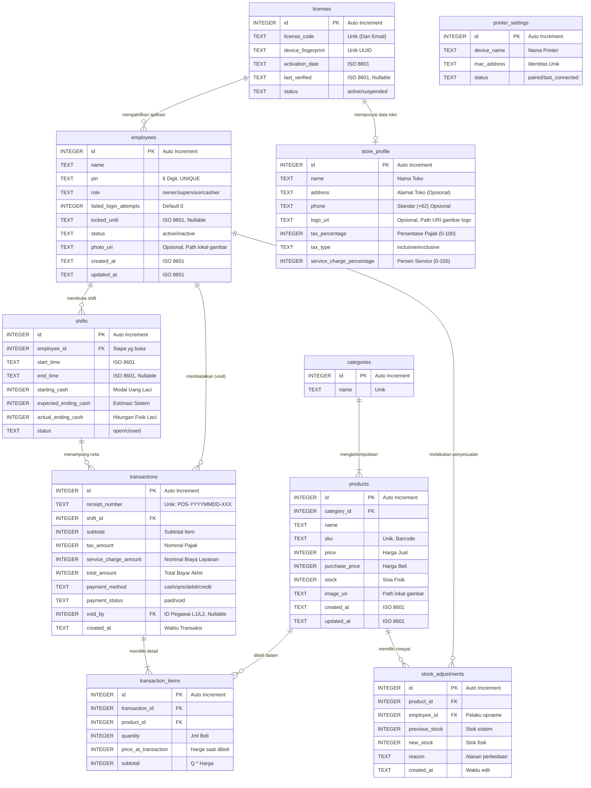

# 🗄️ POSify - Database Schema (ERD)

Dokumen ini memuat skema database relasional (SQLite via Drift ORM) untuk mendukung semua fitur *Offline-First* secara reaktif sesuai dengan draf UI/UX, dan dipersiapkan (*Future-Proof*) untuk sinkronisasi Tier 2 di masa mendatang.

---

## 1. Entity Relationship Diagram (Mermaid)

---

## 2. Struktur Tabel & Penjelasan (SQLite Data Types - Drift ORM)

Di dalam SQLite (yang diatur via Drift ORM), tipe data utama yang dipakai adalah `TEXT` dan `INTEGER`. Tanggal dan UUID akan disesuaikan menjadi *class type-safe* di layer Dart dengan *fallback* fungsi penyimpanan secara `TEXT` berformat `ISO 8601` untuk standar lokalisasi dan sinkronisasi log di Tier 2 nanti.

### a) `licenses` (Otorisasi Perangkat)
Satu perangkat SQLite hanya perlu `SELECT * FROM licenses LIMIT 1`. Jika perangkat terganti, *device fingerprint* tidak akan cocok dan aplikasi akan terkunci otomatis.

### b) `employees` (Pengguna & Hak Akses)
Keamanan L1/L2/L3 dari PRD diimplementasikan lewat tabel ini. Kolom `pin` sifatnya *UNIQUE* sehingga query login sangat cepat dan bebas ambigu. Apabila salah login 5x, kolom `locked_until` akan terisi jam berapa akun bisa dipakai lagi.

### c) `categories` & `products` (Katalog)
`sku` wajib *UNIQUE* untuk memastikan operasional barcode scanner berjalan dengan semestinya. Gambar produk disimpan di variabel `image_uri` yang berisi path absolut ke internal storage HP, agar aplikasi tidak berat menampung BLOB dalam SQLite.

### d) `shifts` (Riwayat Sesi)
Sebuah transaksi (*receipt*) tidak bisa terjadi jika di device tersebut tidak ada `shifts` yang berstatus `open`. Shift diikat per individu (satu kasir satu laci).

### e) `transactions` & `transaction_items` (Nota)
- Data historis (`price_at_transaction`) disimpan secara terpisah di tabel detail. Mengapa? Supaya kalau besok harga produk naik, nota lama yang sudah terjadi tidak ikut membengkak harganya.
- Nilai Pajak (`tax_amount`) dan Service (`service_charge_amount`) di-record per nota secara mutlak (angka rupiahnya) pada saat transaksi final. Ini memastikan rekap harian tidak bocor ketika Owner merubah persentase pajaknya di kemudian hari.
- Jika transaksi di-*Refund* (batal), maka `payment_status` akan berubah jadi `void`, dan `void_by` mencatat `employee_id` sang *Supervisor* (L2) atau *Owner* (L1) yang memberi ACC pembatalan tersebut.

### f) `stock_adjustments` (Audit Trail)
Setiap kali terjadi *Stock Opname* (fitur Tab 2) yang menyebabkan stok produk berubah bukan karena laku dijual, perubahan tersebut akan dicatat di tabel ini beserta alasan kenapa angkanya selisih.

### g) `store_profile` (Informasi Usaha & Konfigurasi Biaya)
Hanya akan berisi 1 baris (single record). Data `name`, `address`, dan `phone` ini akan dipanggil otomatis oleh *Bluetooth Printer* untuk mencetak Header Nota kertas. 
Di tabel ini pula letak variabel Global untuk menghitung **Pajak (PB1/PPN)** dan **Service Charge**. Owner secara bebas mengatur apakah model pajaknya `inclusive` (sudah termasuk harga menu) atau `exclusive` (ditambahkan saat bayar).

### h) `printer_settings` (Koneksi Hardware)
Menyimpan data printer terakhir yang digunakan agar aplikasi bisa otomatis *re-connect* saat kasir dibuka tanpa perlu mengulang proses scanning setiap hari.
