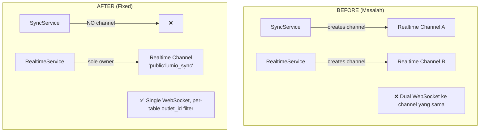
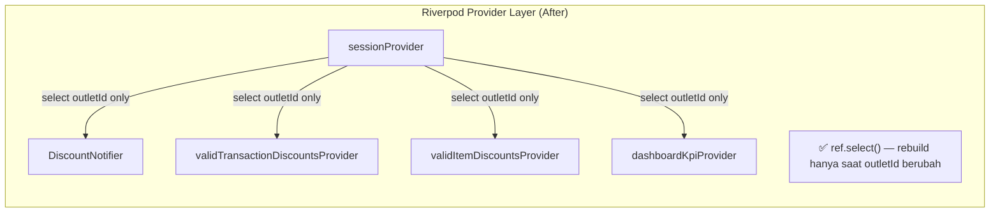
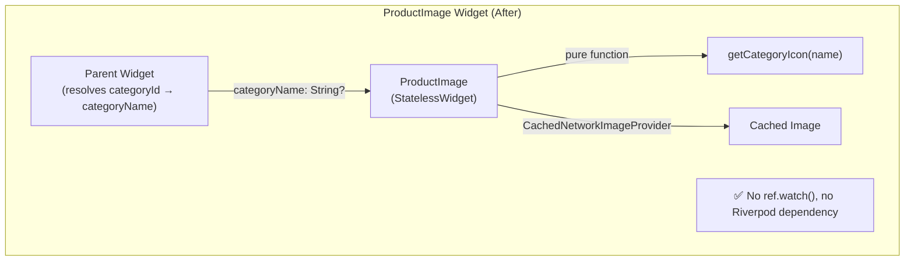
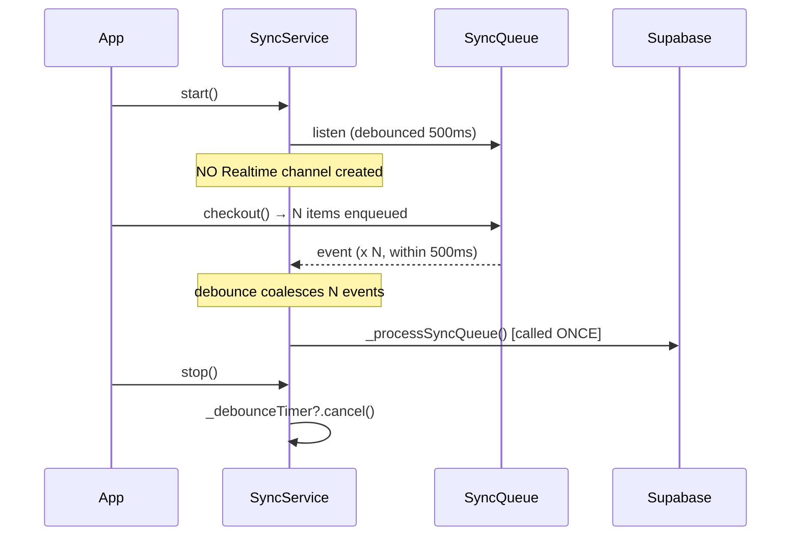
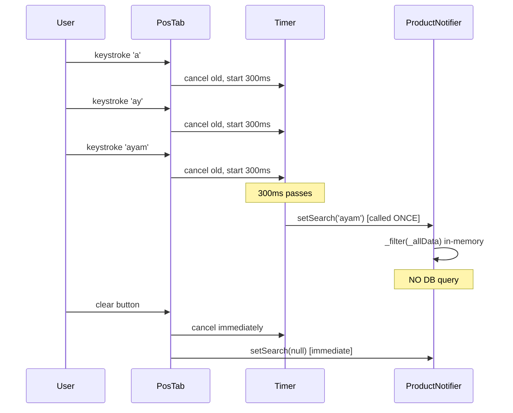
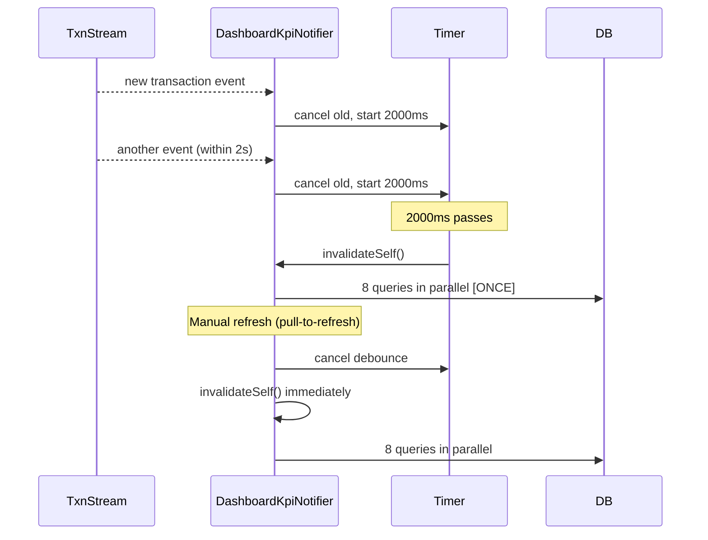

# Design Document: Mobile Performance Fixes

## Overview

Dokumen ini mendeskripsikan desain teknis untuk 15 perbaikan performa pada aplikasi Lumio POS (Flutter).

Semua perubahan bersifat **refactoring internal** — tidak mengubah fungsionalitas yang terlihat pengguna, tetapi menghilangkan UI jank, query berlebihan, memory leak, dan rebuild widget yang tidak perlu.

**Tech Stack:** Flutter + Riverpod ^3.2.1 + Drift ORM ^2.32.0 + Supabase Flutter ^2.8.4

**Scope:** 15 isu (4 Critical 🔴, 6 High 🟠, 5 Medium 🟡)

---

## Architecture

### High-Level Component Diagram (Before vs After)







---

## Components and Interfaces

### 1. SyncService (`lib/core/services/sync_service.dart`)

**Perubahan:** Hapus semua kode Realtime dari SyncService.

```dart
// HAPUS fields ini:
// RealtimeChannel? _realtimeChannel;

// HAPUS methods ini:
// void _startRealtimePull() { ... }
// void _stopRealtimePull() { ... }

// TAMBAH: debounce timer untuk sync queue
Timer? _syncDebounceTimer;

// MODIFIKASI start():
void start() {
  _syncQueueSub?.cancel();
  _connectivitySub?.cancel();

  final db = _ref.read(databaseProvider);

  // Debounced sync queue listener (500ms)
  _syncQueueSub = db.syncQueueNotifier.stream.listen((_) {
    _syncDebounceTimer?.cancel();
    _syncDebounceTimer = Timer(const Duration(milliseconds: 500), () {
      _processSyncQueue();
    });
  });

  _connectivitySub = Connectivity().onConnectivityChanged.listen((results) {
    if (!results.contains(ConnectivityResult.none)) {
      performSync();
    }
  });

  // TIDAK ada _startRealtimePull() di sini
  performSync();
}

// MODIFIKASI stop():
void stop() {
  _syncDebounceTimer?.cancel();  // ← NEW
  _syncDebounceTimer = null;
  _syncQueueSub?.cancel();
  _syncQueueSub = null;
  _connectivitySub?.cancel();
  _connectivitySub = null;
  // TIDAK ada _stopRealtimePull() di sini
  _ref.read(syncStatusProvider.notifier).setStatus(SyncStatus.idle);
}
```

### 2. ProductWithVariantsNotifier (`lib/features/pos/providers/pos_providers.dart`)

**Perubahan:** Tambah `_allData` cache, ubah `setSearch()`/`setCategory()` menjadi in-memory filter.

```dart
class ProductWithVariantsNotifier
    extends AsyncNotifier<List<ProductWithVariants>> {
  String? _searchQuery;
  String? _categoryId;
  List<ProductWithVariants> _allData = [];  // ← NEW cache field

  @override
  Future<List<ProductWithVariants>> build() async {
    final db = ref.watch(databaseProvider);
    final session = ref.watch(sessionProvider).value;
    if (session == null || session.outletId == null) return [];
    final outletId = session.outletId!;

    final subscription = db.watchAllProductsWithVariants(outletId).listen((data) {
      if (ref.mounted) {
        _allData = data;  // ← update cache
        state = AsyncValue.data(_filter(data));
      }
    });
    ref.onDispose(() => subscription.cancel());

    final initialData = await db.getAllProductsWithVariants(outletId);
    _allData = initialData;  // ← populate cache
    return _filter(initialData);
  }

  List<ProductWithVariants> _filter(List<ProductWithVariants> data) {
    final query = _searchQuery?.toLowerCase() ?? '';
    return data.where((pwv) {
      final matchesCategory =
          _categoryId == null || pwv.product.categoryId == _categoryId;
      if (query.isEmpty) return matchesCategory;
      final matchesSearch =
          pwv.product.name.toLowerCase().contains(query) ||
          pwv.product.sku.toLowerCase().contains(query);
      return matchesCategory && matchesSearch;
    }).toList();
  }

  // BEFORE: ref.invalidateSelf() — triggers full DB re-query
  // AFTER:  in-memory filter from _allData
  void setSearch(String? query) {
    _searchQuery = query;
    state = AsyncValue.data(_filter(_allData));  // ← no invalidateSelf()
  }

  void setCategory(String? id) {
    _categoryId = id;
    state = AsyncValue.data(_filter(_allData));  // ← no invalidateSelf()
  }
}
```

### 3. CartNotifier.resumeBill() (`lib/features/pos/providers/pos_providers.dart`)

**Perubahan:** Eliminasi N+1 query dengan batch-fetch + lookup maps.

```dart
Future<void> resumeBill(
    Transaction transaction, List<TransactionItem> items) async {
  try {
    final db = ref.read(databaseProvider);
    final session = ref.read(sessionProvider).value;
    if (session == null || session.outletId == null) return;
    final outletId = session.outletId!;

    clearCart();

    // ── BATCH FETCH (3 queries total, regardless of N items) ──────────────
    final productIds = items.map((i) => i.productId).toSet().toList();
    final variantIds = items
        .where((i) => i.variantId != null)
        .map((i) => i.variantId!)
        .toSet()
        .toList();
    final discountIds = items
        .where((i) => i.discountId != null)
        .map((i) => i.discountId!)
        .toSet()
        .toList();

    // Query 1: all products
    final productList = await db.getProductsByIds(productIds);
    // Query 2: all variants
    final variantList = variantIds.isNotEmpty
        ? await db.getVariantsByIds(variantIds)
        : <ProductVariant>[];
    // Query 3: all discounts
    final discountList = discountIds.isNotEmpty
        ? await db.getDiscountsByIds(discountIds)
        : <Discount>[];

    // ── BUILD LOOKUP MAPS (O(1) resolution) ───────────────────────────────
    final productMap = {for (final p in productList) p.id: p};
    final variantMap = {for (final v in variantList) v.id: v};
    final discountMap = {for (final d in discountList) d.id: d};

    // ── ITERATE ITEMS (no DB calls inside loop) ───────────────────────────
    final resumedItems = <CartItem>[];
    for (final item in items) {
      final product = productMap[item.productId];
      if (product == null) continue;  // Req 3.8: skip missing products

      final variant = item.variantId != null ? variantMap[item.variantId] : null;
      final discount = item.discountId != null ? discountMap[item.discountId] : null;

      resumedItems.add(CartItem(
        product: product,
        variant: variant,
        quantity: item.quantity,
        appliedDiscount: discount,
      ));
    }

    state = resumedItems;
    ref.read(cartNotesProvider.notifier).state = transaction.notes;

    // ── CUSTOMER LOOKUP (single-record, Req 9) ────────────────────────────
    if (transaction.customerId != null) {
      final customer = await db.getCustomerById(transaction.customerId!);
      if (customer != null) {
        ref.read(selectedCustomerProvider.notifier).state = customer;
      }
    }
    if (transaction.customerName != null) {
      ref.read(manualCustomerNameProvider.notifier).state = transaction.customerName;
    }
    if (transaction.customerPhone != null) {
      ref.read(manualCustomerPhoneProvider.notifier).state = transaction.customerPhone;
    }

    await (db.update(db.transactions)..where((t) => t.id.equals(transaction.id)))
        .write(const TransactionsCompanion(
            paymentStatus: Value('resumed')));
  } catch (e) {
    debugPrint('Resume bill error: $e');
  }
}
```

### 4. ProductImage (`lib/core/widgets/product_image.dart`)

**Perubahan:** Ubah dari `ConsumerWidget` → `StatelessWidget`, ganti `categoryId` → `categoryName`, gunakan `CachedNetworkImageProvider`.

**⚠️ Breaking Change — Migration Notes ada di bagian bawah.**

```dart
// BEFORE signature:
class ProductImage extends ConsumerWidget {
  final String? categoryId;  // ← DIHAPUS
  // ...
  Widget build(BuildContext context, WidgetRef ref) { ... }
}

// AFTER signature:
class ProductImage extends StatelessWidget {
  final String? categoryName;  // ← BARU (menggantikan categoryId)
  // ... semua parameter lain tetap sama
  const ProductImage({
    super.key,
    this.imageUri,
    this.productName,
    this.categoryName,  // ← BARU
    this.width,
    this.height,
    this.borderRadius = 8,
    this.iconSize = 24,
    this.fit = BoxFit.cover,
  });

  @override
  Widget build(BuildContext context) {  // ← tidak ada WidgetRef
    String? matchedName = productName?.toLowerCase();
    if (matchedName == null || _isGeneric(matchedName)) {
      matchedName = categoryName?.toLowerCase();  // ← langsung pakai parameter
    }

    return Container(
      // ...
      child: imageUri != null && imageUri!.isNotEmpty
          ? ClipRRect(
              child: Image(
                image: imageUri!.startsWith('http')
                    ? CachedNetworkImageProvider(imageUri!)  // ← BARU
                    : FileImage(File(imageUri!)) as ImageProvider,
                // ... error/loading builders tetap sama
              ),
            )
          : _buildImagePlaceholder(matchedName, iconSize),
    );
  }
  // getCategoryIcon() tetap static, tidak berubah
}
```

**Parent widget yang memanggil ProductImage harus resolve categoryId → categoryName:**

```dart
// BEFORE (di PosProductCard atau widget lain):
ProductImage(
  imageUri: product.imageUri,
  productName: product.name,
  categoryId: product.categoryId,  // ← LAMA
)

// AFTER:
// Ambil categoryName dari categoryProvider yang sudah di-watch di parent
final categories = ref.watch(categoryProvider).value ?? [];
final categoryName = categories
    .firstWhereOrNull((c) => c.id == product.categoryId)
    ?.name;

ProductImage(
  imageUri: product.imageUri,
  productName: product.name,
  categoryName: categoryName,  // ← BARU
)
```

### 5. PosTab Search Debounce (`lib/features/pos/screens/pos_tab.dart`)

**Perubahan:** Tambah `Timer? _debounceTimer` dan debounce 300ms pada `onChanged`.

```dart
class _PosTabState extends ConsumerState<PosTab> {
  final _searchController = TextEditingController();
  String? _selectedCategoryId;
  Timer? _debounceTimer;  // ← NEW

  @override
  void dispose() {
    _debounceTimer?.cancel();  // ← NEW: cancel on dispose
    _searchController.dispose();
    super.dispose();
  }

  // Di dalam _buildAppBar, TextField.onChanged:
  onChanged: (v) {
    _debounceTimer?.cancel();
    _debounceTimer = Timer(const Duration(milliseconds: 300), () {
      ref.read(productProvider.notifier).setSearch(v.isEmpty ? null : v);
    });
  },

  // Clear button: immediate, no debounce
  onPressed: () {
    _debounceTimer?.cancel();  // cancel pending debounce
    _searchController.clear();
    ref.read(productProvider.notifier).setSearch(null);  // immediate
  },
}
```

### 6. DiscountNotifier — ref.select() + StreamSubscription Fix

**Perubahan:** Gunakan `ref.select()` untuk `outletId`, simpan dan cancel `StreamSubscription`.

```dart
class DiscountNotifier extends AsyncNotifier<List<Discount>> {
  @override
  Future<List<Discount>> build() {
    final db = ref.read(databaseProvider);
    // BEFORE: ref.watch(sessionProvider).value?.outletId
    // AFTER:  ref.select() — hanya rebuild saat outletId berubah
    final outletId = ref.watch(
      sessionProvider.select((s) => s.value?.outletId),
    );
    if (outletId == null) return Future.value([]);

    // BEFORE: subscription tidak disimpan, tidak di-cancel
    // AFTER:  simpan dan cancel via ref.onDispose()
    final subscription = db.watchAllDiscounts(outletId).listen((data) {
      if (ref.mounted) state = AsyncValue.data(data);
    });
    ref.onDispose(() => subscription.cancel());  // ← NEW

    return db.getAllDiscounts(outletId);
  }
  // ... save(), remove(), _refresh() tetap sama
}

// validTransactionDiscountsProvider — gunakan ref.select()
final validTransactionDiscountsProvider =
    FutureProvider.family<List<Discount>, double>((ref, cartTotal) {
  final outletId = ref.watch(
    sessionProvider.select((s) => s.value?.outletId),  // ← BARU
  );
  if (outletId == null) return Future.value([]);
  return ref.read(databaseProvider).getValidDiscounts(
    cartTotal: cartTotal, scope: 'transaction', outletId: outletId,
  );
});

// validItemDiscountsProvider — sama
final validItemDiscountsProvider =
    FutureProvider.family<List<Discount>, double>((ref, cartTotal) {
  final outletId = ref.watch(
    sessionProvider.select((s) => s.value?.outletId),  // ← BARU
  );
  if (outletId == null) return Future.value([]);
  return ref.read(databaseProvider).getValidDiscounts(
    cartTotal: cartTotal, scope: 'item', outletId: outletId,
  );
});
```

### 7. CartNotifier.checkout() — Hapus ref.invalidate()

**Perubahan:** Hapus satu baris `ref.invalidate(productProvider)`.

```dart
// BEFORE:
ref.invalidate(productProvider);  // ← HAPUS
clearCart();

// AFTER:
clearCart();  // stream subscription di ProductNotifier sudah handle update stok
```

### 8. dashboardKpiProvider (`lib/features/dashboard/providers/dashboard_kpi_provider.dart`)

**File baru.** Ekstrak logika `_loadStats()` dari `OwnerDashboardScreen` ke Riverpod provider.

```dart
import 'dart:async';
import 'package:flutter_riverpod/flutter_riverpod.dart';
import 'package:lumio/core/database/database.dart';
import 'package:lumio/core/providers/database_provider.dart';
import 'package:lumio/features/auth/providers/owner_provider.dart';
import 'package:lumio/features/dashboard/widgets/low_stock_widget.dart';

class DashboardKpiData {
  final List<KpiItem> kpis;
  final LowStockSummary lowStockSummary;
  const DashboardKpiData({required this.kpis, required this.lowStockSummary});
}

class DashboardKpiNotifier extends AsyncNotifier<DashboardKpiData> {
  Timer? _debounceTimer;
  StreamSubscription? _txnSubscription;

  @override
  Future<DashboardKpiData> build() async {
    final outletId = ref.watch(
      sessionProvider.select((s) => s.value?.outletId),  // ref.select()
    );
    if (outletId == null) {
      return DashboardKpiData(kpis: [], lowStockSummary: const LowStockSummary(products: [], ingredients: []));
    }

    final db = ref.read(databaseProvider);

    // Watch transactions stream — debounced refresh
    _txnSubscription?.cancel();
    _txnSubscription = db.watchAllTransactions(outletId).listen((_) {
      _debounceTimer?.cancel();
      _debounceTimer = Timer(const Duration(milliseconds: 2000), () {
        if (ref.mounted) ref.invalidateSelf();
      });
    });

    ref.onDispose(() {
      _debounceTimer?.cancel();   // Req 15.4
      _txnSubscription?.cancel(); // Req 10.8
    });

    return _fetchKpiData(outletId, db);
  }

  Future<DashboardKpiData> _fetchKpiData(String outletId, LumioDatabase db) async {
    final now = DateTime.now();
    final todayStart = DateTime(now.year, now.month, now.day);
    final todayEnd = DateTime(now.year, now.month, now.day, 23, 59, 59);
    final yestStart = todayStart.subtract(const Duration(days: 1));
    final yestEnd = DateTime(yestStart.year, yestStart.month, yestStart.day, 23, 59, 59);

    // 8 queries in parallel (same as _loadStats())
    final results = await Future.wait([
      db.getTotalRevenue(todayStart, todayEnd, outletId),
      db.getTotalRevenue(yestStart, yestEnd, outletId),
      db.getTotalTransactions(todayStart, todayEnd, outletId),
      db.getTotalTransactions(yestStart, yestEnd, outletId),
      db.getTopProducts(todayStart, todayEnd, outletId),
      db.getHourlySales(todayStart, todayEnd, outletId),
      db.getLowStockProductsFiltered(outletId: outletId),
      db.getLowStockIngredients(outletId: outletId),
    ]);
    // ... build KpiItem list from results (same logic as _loadStats())
    return DashboardKpiData(kpis: kpis, lowStockSummary: lowStockSummary);
  }

  // Manual refresh (from RefreshIndicator) — immediate, no debounce (Req 15.3)
  Future<void> refresh() async {
    _debounceTimer?.cancel();
    ref.invalidateSelf();
  }
}

final dashboardKpiProvider =
    AsyncNotifierProvider<DashboardKpiNotifier, DashboardKpiData>(
        DashboardKpiNotifier.new);
```

**OwnerDashboardScreen** diubah untuk menggunakan provider ini:

```dart
// BEFORE: ConsumerStatefulWidget dengan _isLoading, _kpis, _loadStats(), _txnSubscription
// AFTER:  ConsumerWidget yang watch dashboardKpiProvider

class OwnerDashboardScreen extends ConsumerWidget {
  @override
  Widget build(BuildContext context, WidgetRef ref) {
    final kpiAsync = ref.watch(dashboardKpiProvider);
    // ...
    return Scaffold(
      body: RefreshIndicator(
        onRefresh: () => ref.read(dashboardKpiProvider.notifier).refresh(),
        child: CustomScrollView(
          slivers: [
            SliverToBoxAdapter(
              child: _buildHero(name, isOwner, kpiAsync),  // pass async state
            ),
            // ... rest of slivers
          ],
        ),
      ),
    );
  }

  Widget _buildHero(String name, bool isOwner, AsyncValue<DashboardKpiData> kpiAsync) {
    return Container(
      // ...
      child: Column(
        children: [
          // ... greeting row
          SizedBox(
            height: 120,
            child: kpiAsync.when(
              loading: () => const Center(child: CircularProgressIndicator(color: Colors.white, strokeWidth: 2)),
              error: (e, _) => const SizedBox(),
              data: (data) => ListView.builder(
                itemCount: data.kpis.length,
                itemBuilder: (ctx, i) => _KpiCard(data: data.kpis[i], isFirst: i == 0),
              ),
            ),
          ),
        ],
      ),
    );
  }
}
```

### 9. GoogleFonts Static Constants

**Perubahan:** Definisikan `TextStyle` yang sering dipakai sebagai `static final` di level class.

```dart
// BEFORE (di setiap build()):
Text('Label', style: GoogleFonts.poppins(fontSize: 14, fontWeight: FontWeight.w600))

// AFTER (di level class, di luar build()):
class _PosTabState extends ConsumerState<PosTab> {
  // Static final — dibuat sekali, di-reuse setiap rebuild
  static final _styleLabel = GoogleFonts.poppins(
    fontSize: 14, fontWeight: FontWeight.w600, color: AppTheme.textPrimary,
  );
  static final _styleSubtitle = GoogleFonts.poppins(
    fontSize: 11, color: AppTheme.textSecondary,
  );
  // ... dst untuk setiap TextStyle yang tidak bergantung pada runtime value

  @override
  Widget build(BuildContext context) {
    // Gunakan _styleLabel, _styleSubtitle, dll.
  }
}
```

### 10. GridView mainAxisExtent (`lib/features/pos/screens/pos_tab.dart`)

**Perubahan:** Ganti `childAspectRatio` dengan `mainAxisExtent` untuk menghilangkan intrinsic height measurement.

```dart
// BEFORE:
SliverGridDelegateWithFixedCrossAxisCount(
  crossAxisCount: isDesktop ? 4 : 2,
  childAspectRatio: 0.75,
  crossAxisSpacing: 12,
  mainAxisSpacing: 12,
)

// AFTER:
SliverGridDelegateWithFixedCrossAxisCount(
  crossAxisCount: isDesktop ? 4 : 2,
  mainAxisExtent: 200,  // fixed pixel height, equivalent to ~0.75 ratio on 375px screen
  crossAxisSpacing: 12,
  mainAxisSpacing: 12,
)
```

### 11. New Database Methods (`lib/core/database/database.dart`)

**Metode baru yang dibutuhkan oleh resumeBill() batch-fetch:**

```dart
// Batch fetch products by list of IDs
Future<List<Product>> getProductsByIds(List<String> ids) {
  if (ids.isEmpty) return Future.value([]);
  return (select(products)
    ..where((p) => p.id.isIn(ids) & p.deletedAt.isNull()))
    .get();
}

// Batch fetch variants by list of IDs
Future<List<ProductVariant>> getVariantsByIds(List<String> ids) {
  if (ids.isEmpty) return Future.value([]);
  return (select(productVariants)
    ..where((v) => v.id.isIn(ids) & v.deletedAt.isNull()))
    .get();
}

// Batch fetch discounts by list of IDs
Future<List<Discount>> getDiscountsByIds(List<String> ids) {
  if (ids.isEmpty) return Future.value([]);
  return (select(discounts)
    ..where((d) => d.id.isIn(ids)))
    .get();
}

// Single-record customer lookup (Req 9)
Future<Customer?> getCustomerById(String id) =>
    (select(customers)..where((c) => c.id.equals(id))).getSingleOrNull();
```

### 12. pubspec.yaml — Tambah cached_network_image

```yaml
dependencies:
  # ... existing deps
  cached_network_image: ^3.4.1  # ← TAMBAH
```

---

## Data Models

Tidak ada perubahan schema database (Drift tables). Perubahan hanya pada:

1. **`DashboardKpiData`** — model baru untuk `dashboardKpiProvider`:
   ```dart
   class DashboardKpiData {
     final List<KpiItem> kpis;
     final LowStockSummary lowStockSummary;
   }
   ```

2. **`ProductImage` constructor** — breaking change pada parameter:
   - Hapus: `String? categoryId`
   - Tambah: `String? categoryName`

---

## Data Flow Diagrams

### Sync Flow (After — Req 1 & 14)



### Search Debounce Flow (After — Req 5)



### Dashboard KPI Refresh Flow (After — Req 10 & 15)



---

## Correctness Properties

*A property is a characteristic or behavior that should hold true across all valid executions of a system — essentially, a formal statement about what the system should do. Properties serve as the bridge between human-readable specifications and machine-verifiable correctness guarantees.*

PBT berlaku untuk feature ini karena ada beberapa fungsi murni (pure functions) dan invariant yang harus berlaku untuk semua input: filter in-memory, debounce coalescing, dan referential transparency `getCategoryIcon()`.

**Library PBT:** [`dart_test`](https://pub.dev/packages/test) + [`fast_check`](https://pub.dev/packages/fast_check) (atau implementasi manual dengan `dart:math` Random untuk generator sederhana). Minimum 100 iterasi per property test.

#### Refleksi Redundansi

Sebelum menulis properties, identifikasi redundansi:

- **2.7 (search round-trip)** dan **2.8 (category round-trip)** adalah dua instansi dari pola yang sama. Keduanya dipertahankan karena menguji dimensi filter yang berbeda (search vs category).
- **3.1** dan **3.6** adalah pernyataan yang sama (query count independent of N). Digabung menjadi satu property.
- **4.7** dan **4.8** adalah pernyataan yang sama (referential transparency). Digabung menjadi satu property.
- **5.1-5.3** (search debounce) dan **14.1-14.2** (sync debounce) adalah instansi dari pola debounce coalescing yang sama. Digabung menjadi satu property dengan parameter.
- **6.5** (no rebuild when outletId unchanged) dipertahankan sebagai property tersendiri.

### Property 1: Filter Round-Trip — Search

*For any* `List<ProductWithVariants>` yang valid dan query string apapun, memanggil `setSearch(query)` lalu `setSearch(null)` harus menghasilkan state yang ekuivalen dengan `_allData` (dataset asli tanpa filter).

**Validates: Requirements 2.7**

### Property 2: Filter Round-Trip — Category

*For any* `List<ProductWithVariants>` yang valid dan category ID apapun, memanggil `setCategory(id)` lalu `setCategory(null)` harus menghasilkan state yang ekuivalen dengan `_allData`.

**Validates: Requirements 2.8**

### Property 3: Filter Idempotence

*For any* `List<ProductWithVariants>` yang valid, query string, dan category ID, menerapkan `_filter(data, query, category)` dua kali berturutan harus menghasilkan hasil yang identik dengan menerapkannya sekali:

```
_filter(_filter(data, q, cat), q, cat) == _filter(data, q, cat)
```

**Validates: Requirements 2.4, 2.5**

### Property 4: Filter Subset Invariant

*For any* `List<ProductWithVariants>` yang valid dan parameter filter apapun, hasil filter harus selalu merupakan subset dari dataset asli:

```
len(_filter(data, query, category)) <= len(data)
```

**Validates: Requirements 2.4, 2.5**

### Property 5: N+1 Query Elimination

*For any* transaksi dengan N item (N ≥ 1), jumlah query database yang dieksekusi oleh `resumeBill()` harus konstan (≤ 3) dan tidak bergantung pada N:

```
queryCount(resumeBill(txn_with_1_item)) == queryCount(resumeBill(txn_with_N_items))
```

**Validates: Requirements 3.1, 3.6**

### Property 6: getCategoryIcon Referential Transparency

*For any* string input yang valid, `getCategoryIcon()` harus selalu mengembalikan nilai yang sama untuk input yang sama (pure function, no side effects):

```
getCategoryIcon(name) == getCategoryIcon(name)  // for all name
```

**Validates: Requirements 4.7, 4.8**

### Property 7: Debounce Coalescing

*For any* N panggilan (N ≥ 2) dalam window debounce W, hanya satu eksekusi yang terjadi setelah W berlalu:

```
N calls within W → exactly 1 execution after W
```

Berlaku untuk: search debounce (W=300ms), sync queue debounce (W=500ms), dashboard debounce (W=2000ms).

**Validates: Requirements 5.1, 5.2, 5.3, 14.1, 14.2, 15.1, 15.2**

### Property 8: ref.select() Rebuild Isolation

*For any* perubahan pada `sessionProvider` yang tidak mengubah nilai `outletId`, provider-provider yang menggunakan `ref.select((s) => s.value?.outletId)` tidak boleh rebuild (build() tidak dipanggil ulang).

**Validates: Requirements 6.5**

---

## Error Handling

| Skenario | Penanganan |
|---|---|
| `resumeBill()`: product tidak ditemukan di DB | Skip item, lanjutkan item berikutnya (Req 3.8) |
| `resumeBill()`: variant tidak ditemukan | `variant = null`, gunakan harga produk |
| `resumeBill()`: discount tidak ditemukan | `discount = null`, item tanpa diskon |
| `getCustomerById()`: ID tidak ada | Return `null`, tidak set `selectedCustomerProvider` |
| `dashboardKpiProvider`: outletId null | Return empty `DashboardKpiData` |
| `SyncService._processSyncQueue()`: error pada satu task | Stop batch, retry pada siklus berikutnya (existing behavior) |
| `CachedNetworkImageProvider`: network error | `errorBuilder` menampilkan placeholder ikon (existing behavior) |
| `ProductWithVariantsNotifier`: stream error | State tetap pada data terakhir yang valid |

---

## Testing Strategy

### Dual Testing Approach

Setiap perbaikan diuji dengan kombinasi unit test (contoh spesifik) dan property test (universal).

### Unit Tests

Fokus pada contoh spesifik dan edge cases:

- `ProductWithVariantsNotifier`: verifikasi `_allData` terpopulasi setelah `build()`, verifikasi `setSearch()` tidak memanggil `invalidateSelf()`
- `CartNotifier.resumeBill()`: verifikasi `getProductsByIds()` dipanggil sekali, verifikasi item dengan product null di-skip
- `ProductImage`: verifikasi extends `StatelessWidget`, verifikasi tidak ada `ref.watch()`, verifikasi `CachedNetworkImageProvider` digunakan untuk URL http
- `DiscountNotifier`: verifikasi `subscription.cancel()` dipanggil saat dispose
- `CartNotifier.checkout()`: verifikasi `ref.invalidate(productProvider)` tidak dipanggil
- `LumioDatabase.getCustomerById()`: verifikasi return `Customer` untuk ID valid, return `null` untuk ID tidak ada
- `dashboardKpiProvider`: verifikasi 8 queries dijalankan, verifikasi `ref.onDispose()` cancel timer dan subscription

### Property Tests

Konfigurasi: minimum **100 iterasi** per property test. Setiap test diberi tag referensi ke property di design document.

```dart
// Tag format: Feature: mobile-performance-fixes, Property N: <property_text>

// Property 1 & 2: Filter Round-Trip
// Feature: mobile-performance-fixes, Property 1: Filter Round-Trip Search
test('setSearch round-trip returns _allData', () {
  for (int i = 0; i < 100; i++) {
    final data = generateRandomProductList();
    final query = generateRandomString();
    notifier.setSearch(query);
    notifier.setSearch(null);
    expect(notifier.state.value, equals(data));
  }
});

// Property 3: Filter Idempotence
// Feature: mobile-performance-fixes, Property 3: Filter Idempotence
test('applying filter twice == applying once', () {
  for (int i = 0; i < 100; i++) {
    final data = generateRandomProductList();
    final q = generateRandomString();
    final cat = generateRandomCategoryId();
    final once = filter(data, q, cat);
    final twice = filter(once, q, cat);
    expect(twice, equals(once));
  }
});

// Property 5: N+1 Elimination
// Feature: mobile-performance-fixes, Property 5: N+1 Query Elimination
test('resumeBill query count is independent of N', () {
  for (int n in [1, 5, 10, 20, 50]) {
    final txn = generateTransactionWithNItems(n);
    final queryCount = countQueriesFor(() => resumeBill(txn));
    expect(queryCount, lessThanOrEqualTo(3));
  }
});

// Property 6: getCategoryIcon Referential Transparency
// Feature: mobile-performance-fixes, Property 6: getCategoryIcon Referential Transparency
test('getCategoryIcon is pure function', () {
  for (int i = 0; i < 100; i++) {
    final name = generateRandomString();
    expect(ProductImage.getCategoryIcon(name),
           equals(ProductImage.getCategoryIcon(name)));
  }
});

// Property 7: Debounce Coalescing
// Feature: mobile-performance-fixes, Property 7: Debounce Coalescing
test('N calls within debounce window → 1 execution', () {
  for (int n = 2; n <= 20; n++) {
    int callCount = 0;
    final timer = DebounceTimer(Duration(milliseconds: 300), () => callCount++);
    for (int i = 0; i < n; i++) {
      timer.reset();
    }
    fakeAsync.elapse(Duration(milliseconds: 400));
    expect(callCount, equals(1));
  }
});
```

---

## Migration Notes

### ⚠️ Breaking Change: ProductImage API

`ProductImage` mengubah parameter dari `categoryId: String?` menjadi `categoryName: String?`.

**Semua call site yang menggunakan `categoryId` harus diupdate.**

Cari dengan: `grep -r "categoryId:" lib/ --include="*.dart" | grep "ProductImage"`

**Pola migrasi:**

```dart
// SEBELUM:
ProductImage(
  imageUri: product.imageUri,
  productName: product.name,
  categoryId: product.categoryId,  // ← HAPUS
)

// SESUDAH (di dalam ConsumerWidget yang sudah watch categoryProvider):
final categories = ref.watch(categoryProvider).value ?? [];
final categoryName = categories
    .firstWhereOrNull((c) => c.id == product.categoryId)
    ?.name;

ProductImage(
  imageUri: product.imageUri,
  productName: product.name,
  categoryName: categoryName,  // ← GANTI
)
```

**File yang perlu diupdate (berdasarkan grep):**
- `lib/features/pos/screens/pos_tab.dart` (di `_showImagePreview()`)
- `lib/features/pos/widgets/pos_cards.dart` (di `PosProductCard`)
- `lib/features/pos/screens/inventory_tab.dart` (jika ada)
- Semua widget lain yang menggunakan `ProductImage` dengan `categoryId`

**Catatan:** Parent widget yang memanggil `ProductImage` biasanya sudah `watch(categoryProvider)` untuk menampilkan chip kategori, sehingga overhead tambahan minimal.

### pubspec.yaml — Tambah Dependency

```yaml
cached_network_image: ^3.4.1
```

Jalankan `flutter pub get` setelah menambahkan dependency ini.

### File Baru

- `lib/features/dashboard/providers/dashboard_kpi_provider.dart` — provider baru untuk KPI dashboard

### Drift Codegen

Setelah menambahkan metode baru ke `database.dart` (`getProductsByIds`, `getVariantsByIds`, `getDiscountsByIds`, `getCustomerById`), **tidak perlu** menjalankan `build_runner` karena metode-metode ini adalah query manual (bukan generated code). Namun jika ada perubahan pada table definitions, jalankan:

```bash
flutter pub run build_runner build --delete-conflicting-outputs
```
